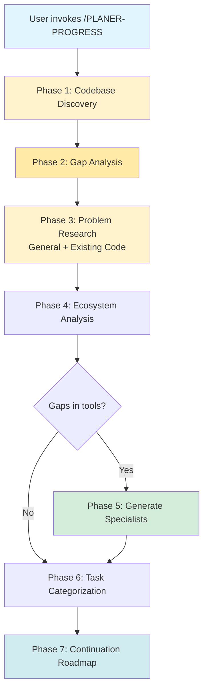

# PLANER-PROGRESS (AGENT-02): Project Continuation Orchestration

## Overview

**PLANER-PROGRESS** is the evolution of PLANER-ZERO for **projects in progress**. While PLANER-ZERO starts from scratch, PLANER-PROGRESS picks up where you left off - analyzing existing codebases, identifying gaps, researching problems (both general and specific to your code), and creating actionable roadmaps to completion.

**Parent:** PLANER-ZERO
**Status:** Design Phase
**Target:** Existing projects with active development

---

## Key Differences from PLANER-ZERO

| Aspect | PLANER-ZERO (Greenfield) | PLANER-PROGRESS (In-Progress) |
|--------|--------------------------|-------------------------------|
| **Phase 1** | Project Discovery (questions) | **Codebase Discovery** (analyze existing files) |
| **Focus** | "What should we build?" | "What exists? What's missing? What needs fixing?" |
| **Problem Research** | General tech stack issues | General + **existing code issues** |
| **Task Types** | All "Add new" | **Fix, Improve, Add, Migrate, Refactor** |
| **Dependencies** | Clean dependency graph | **Must respect existing architecture** |
| **Output** | Implementation plan | **Continuation roadmap + technical debt backlog** |
| **Context** | None (fresh start) | **Existing codebase context (high priority)** |

---

## Workflow: 7 Phases



---

## Phase 1: Codebase Discovery & Analysis

**Goal:** Understand what exists, what works, what's broken, what's incomplete

**Approach:** Delegate to **Explore agent** (thorough mode) with specific discovery prompts

### Discovery Tasks

#### 1.1 Project Structure Analysis
```bash
# Use Explore agent to map the codebase
Task: "Analyze the project structure and identify:
- Project type (WordPress theme, Next.js app, API, etc.)
- Tech stack (frameworks, libraries, build tools)
- Directory structure and organization patterns
- Entry points and main configuration files
Output: project_structure.json"
```

**Output Format:** `project_structure.json`
```json
{
  "project_type": "WordPress Block Theme",
  "tech_stack": {
    "cms": "WordPress 6.8+",
    "framework": "WordPress Interactivity API",
    "build_tool": "@wordpress/scripts (webpack)",
    "languages": ["PHP 8.0+", "JavaScript ES6+", "CSS"],
    "package_manager": "npm"
  },
  "directory_structure": {
    "blocks/": "Custom Gutenberg blocks (13 blocks found)",
    "inc/": "PHP functionality (components, customizer, woocommerce integration)",
    "assets/": "Built CSS/JS assets",
    "templates/": "FSE templates",
    "template-parts/": "FSE template parts"
  },
  "entry_points": {
    "main": "functions.php",
    "theme_config": "theme.json",
    "build_config": "webpack.config.js"
  },
  "estimated_size": {
    "files": 156,
    "lines_of_code": 8500,
    "custom_blocks": 13,
    "php_classes": 12
  }
}
```

#### 1.2 Feature Inventory
```bash
Task: "Catalog all implemented features:
- List all custom blocks and their functionality
- Identify WooCommerce integrations
- Find customizer settings
- Map AJAX endpoints and REST routes
- Identify third-party integrations
Output: feature_inventory.json"
```

**Output Format:** `feature_inventory.json`
```json
{
  "custom_blocks": [
    {
      "name": "hero-woocommerce-slider",
      "status": "complete",
      "features": ["Auto-rotation", "Product display", "Touch gestures"],
      "dependencies": ["WooCommerce"],
      "interactivity": "WordPress Interactivity API"
    },
    {
      "name": "hero-product-switcher",
      "status": "complete",
      "features": ["Product switching", "Image gallery sync"],
      "dependencies": ["WooCommerce"],
      "interactivity": "WordPress Interactivity API"
    },
    {
      "name": "floating-add-to-cart",
      "status": "complete",
      "features": ["Sticky cart", "Scroll trigger", "AJAX add to cart"],
      "dependencies": ["WooCommerce"]
    },
    {
      "name": "product-gallery",
      "status": "complete",
      "features": ["Lightbox", "Zoom", "Thumbnails", "Keyboard navigation"],
      "dependencies": ["WooCommerce"]
    },
    {
      "name": "scroll-progress-indicator",
      "status": "complete",
      "features": ["Reading progress", "Smooth scroll"]
    }
  ],
  "woocommerce_integrations": [
    {
      "component": "Hero Slider",
      "type": "Product display",
      "status": "complete"
    },
    {
      "component": "AJAX Add to Cart",
      "type": "Cart functionality",
      "status": "complete"
    }
  ],
  "customizer_sections": [
    {
      "name": "Hero Slider Settings",
      "status": "complete"
    },
    {
      "name": "Hero Product Switcher Settings",
      "status": "complete"
    }
  ],
  "total_features": 15,
  "completion_estimate": "85%"
}
```

#### 1.3 Code Quality Scan
```bash
Task: "Scan for code quality indicators:
- TODO/FIXME comments (incomplete work)
- Console.log/var_dump (debug code left behind)
- Deprecated WordPress functions
- Missing error handling
- Security concerns (unescaped output, unsanitized input)
- Performance issues (N+1 queries, large bundle sizes)
Output: quality_report.json"
```

**Output Format:** `quality_report.json`
```json
{
  "todos_and_fixmes": [
    {
      "file": "blocks/hero-slider/view.js",
      "line": 45,
      "content": "// TODO: Add lazy loading for non-visible slides",
      "priority": "medium"
    }
  ],
  "debug_code": [],
  "deprecated_functions": [],
  "security_concerns": [
    {
      "type": "potential_xss",
      "file": "inc/components/class-hero-slider.php",
      "line": 123,
      "issue": "Direct output without escaping",
      "severity": "high",
      "recommendation": "Use esc_html() or esc_attr()"
    }
  ],
  "performance_issues": [
    {
      "type": "large_bundle",
      "file": "assets/js/hero-slider.js",
      "size": "45KB",
      "recommendation": "Consider code splitting or lazy loading"
    }
  ],
  "code_quality_score": 8.5,
  "critical_issues": 0,
  "high_priority_issues": 1,
  "medium_priority_issues": 3
}
```

#### 1.4 Dependency Analysis
```bash
Task: "Analyze dependencies and compatibility:
- npm packages and versions
- WordPress version requirements
- PHP version requirements
- WooCommerce version compatibility
- Browser compatibility requirements
- Check for outdated packages
Output: dependency_report.json"
```

#### 1.5 Documentation Audit
```bash
Task: "Review existing documentation:
- README completeness
- Code comments coverage
- PHPDoc/JSDoc presence
- Setup instructions
- Deployment guides
- Missing documentation areas
Output: documentation_audit.json"
```

**Total Phase 1 Output:** 5 JSON files (~20k tokens analyzed, 8k summary stored)

---

## Phase 2: Gap Analysis

**Goal:** Identify what's built vs. what's planned/needed

**Approach:** Compare feature inventory against:
1. Project goals (ask user if not documented)
2. Industry standards for this project type
3. Common features missing

### Gap Analysis Process

#### 2.1 User Requirements Clarification

Use `AskUserQuestion` to understand project goals:

```yaml
questions:
  - question: "What is the primary goal for this project's next phase?"
    header: "Project Goal"
    multiSelect: false
    options:
      - label: "Complete Existing Features"
        description: "Finish incomplete work, fix bugs, polish what exists"
      - label: "Add New Features"
        description: "Extend functionality with new blocks, integrations, or capabilities"
      - label: "Refactor & Optimize"
        description: "Improve code quality, performance, security, maintainability"
      - label: "Prepare for Launch"
        description: "Testing, documentation, deployment readiness, final polish"

  - question: "What specific features or improvements are most important?"
    header: "Priorities"
    multiSelect: true
    options:
      - label: "Performance Optimization"
        description: "Faster load times, smaller bundles, better Core Web Vitals"
      - label: "Accessibility (a11y)"
        description: "WCAG compliance, keyboard navigation, screen reader support"
      - label: "Mobile Experience"
        description: "Responsive design, touch gestures, mobile performance"
      - label: "SEO Improvements"
        description: "Structured data, meta tags, semantic HTML, performance"
      - label: "E-commerce Features"
        description: "More WooCommerce integrations, cart improvements, product displays"
      - label: "Security Hardening"
        description: "Input validation, output escaping, nonce verification"
      - label: "Testing & Quality"
        description: "Unit tests, integration tests, E2E tests, CI/CD"
      - label: "Documentation"
        description: "Developer docs, user guides, inline comments, setup instructions"

  - question: "Are there any known bugs or issues that need fixing?"
    header: "Bug Fixes"
    multiSelect: false
    options:
      - label: "Yes - Critical bugs to fix"
        description: "There are blocking issues that need immediate attention"
      - label: "Yes - Minor issues to address"
        description: "Small bugs or quirks that should be fixed when possible"
      - label: "No known issues"
        description: "Everything works as expected currently"
```

#### 2.2 Compare Against Standards

Based on project type (WordPress Block Theme with WooCommerce), check for:

**Missing Standard Features:**
- [ ] Automated testing (PHPUnit, Jest)
- [ ] CI/CD pipeline (GitHub Actions)
- [ ] Performance monitoring
- [ ] Error logging
- [ ] Analytics integration
- [ ] Internationalization (i18n)
- [ ] RTL (Right-to-Left) support
- [ ] Dark mode support
- [ ] Print styles
- [ ] Social sharing meta tags

**Output Format:** `gap_analysis.json`
```json
{
  "user_goals": {
    "primary_goal": "Add New Features",
    "priorities": ["E-commerce Features", "Performance Optimization", "Accessibility"]
  },
  "feature_gaps": {
    "critical": [
      {
        "feature": "Automated Testing",
        "why_important": "Prevent regressions, ensure code quality",
        "estimated_effort": "medium",
        "priority": "high"
      }
    ],
    "recommended": [
      {
        "feature": "Internationalization (i18n)",
        "why_important": "Reach non-English audiences, WordPress best practice",
        "estimated_effort": "low",
        "priority": "medium"
      },
      {
        "feature": "Wishlist/Compare Features",
        "why_important": "Common e-commerce expectation, improves UX",
        "estimated_effort": "high",
        "priority": "medium"
      }
    ],
    "nice_to_have": [
      {
        "feature": "Dark Mode Support",
        "why_important": "Modern UI trend, accessibility benefit",
        "estimated_effort": "medium",
        "priority": "low"
      }
    ]
  },
  "incomplete_work": [
    {
      "item": "Hero slider lazy loading",
      "source": "TODO comment in code",
      "priority": "medium"
    }
  ],
  "technical_debt": [
    {
      "item": "Large JavaScript bundle (45KB)",
      "impact": "Slower page load, poor mobile experience",
      "recommendation": "Code splitting, lazy loading",
      "priority": "high"
    },
    {
      "item": "Missing error boundaries in Interactivity API blocks",
      "impact": "Poor error handling, potential white screens",
      "recommendation": "Add try/catch blocks, fallback UI",
      "priority": "medium"
    }
  ]
}
```

**Total Phase 2 Output:** 1 JSON file (~6k tokens)

---

## Phase 3: Problem Research (Dual Mode)

**Goal:** Research BOTH general tech stack issues AND existing codebase problems

**Approach:** Two-pronged WebSearch strategy

### 3.1 General Tech Stack Research (from PLANER-ZERO)

Same as PLANER-ZERO Phase 2:
- "WordPress Interactivity API common mistakes 2026"
- "WooCommerce performance optimization 2026"
- "WordPress block theme best practices 2026"
- etc.

### 3.2 NEW: Existing Codebase Problem Research

**Focus on patterns found in Phase 1:**

#### Pattern-Based Searches

If quality scan found: "Large JavaScript bundle (45KB)"
→ Search: "WordPress Interactivity API bundle size optimization 2026"
→ Search: "webpack code splitting WordPress blocks 2026"

If quality scan found: "Missing error handling"
→ Search: "WordPress Interactivity API error handling best practices 2026"
→ Search: "React error boundaries WordPress blocks 2026"

If feature inventory shows: "WooCommerce AJAX cart"
→ Search: "WooCommerce AJAX cart security 2026"
→ Search: "WooCommerce cart nonce verification 2026"

#### Vulnerability Research

```
"WordPress WooCommerce security vulnerabilities 2025 2026"
"WordPress Interactivity API XSS prevention 2026"
"@wordpress/scripts webpack vulnerabilities 2026"
```

#### Specific Technology Deep Dives

For discovered tech stack:
```
"WordPress 6.8 Interactivity API breaking changes"
"@wordpress/scripts webpack 5 migration issues 2026"
"WooCommerce 8.x compatibility WordPress 6.8"
```

**Output Format:** `problems.json` (enhanced)
```json
{
  "research_date": "2026-01-17",
  "project_specific_problems": [
    {
      "problem": "Large JavaScript bundle affecting mobile performance",
      "current_state": "45KB bundle for hero-slider.js",
      "why": "Webpack bundling all dependencies together, no code splitting",
      "solution": "Implement dynamic imports for non-critical slider features",
      "bad_code": "import { SwiperCore, Navigation, Pagination, Autoplay } from 'swiper';",
      "good_code": "const Swiper = await import('swiper/bundle');",
      "impact": "3-5s faster load on 3G connections",
      "source": "Web research + codebase analysis",
      "priority": "high"
    },
    {
      "problem": "Interactivity API context not captured before animations",
      "current_state": "Found in scroll-progress-indicator/view.js",
      "why": "getContext() called inside requestAnimationFrame callback",
      "solution": "Capture context before RAF: const ctx = getContext(); requestAnimationFrame(() => {...})",
      "files_affected": ["scroll-progress-indicator/view.js", "product-gallery/view.js"],
      "priority": "high",
      "preventive": true
    }
  ],
  "general_tech_problems": [
    // Same format as PLANER-ZERO problems.json
  ]
}
```

**Total Phase 3 Output:** 1 enhanced JSON file (~10k tokens)

---

## Phase 4: Ecosystem Analysis

**Same as PLANER-ZERO Phase 3**

Identify existing agents/skills and gaps.

**Output:** `tool_inventory.json` (~4k tokens)

---

## Phase 5: Generate Specialist Agents (if needed)

**Same as PLANER-ZERO Phase 4**

Create global reusable specialists based on problems.json.

**Output:** Specialist agent files + metadata (~2k tokens in main context)

---

## Phase 6: Task Categorization & Prioritization

**Goal:** Break work into categorized, prioritized tasks

**NEW: Task Categories:**

1. **FIX** - Bugs, security issues, critical problems
2. **IMPROVE** - Performance, accessibility, code quality
3. **REFACTOR** - Technical debt, code organization
4. **ADD** - New features, functionality
5. **TEST** - Automated tests, quality assurance
6. **DOCUMENT** - Docs, comments, guides
7. **DEPLOY** - CI/CD, production readiness

### Task Prioritization Matrix

| Priority | Category | Criteria |
|----------|----------|----------|
| **P0 - Critical** | FIX | Security vulnerabilities, broken functionality, data loss risk |
| **P1 - High** | FIX, IMPROVE | Major bugs, significant performance issues, user-facing problems |
| **P2 - Medium** | IMPROVE, ADD, REFACTOR | User-requested features, moderate technical debt, minor bugs |
| **P3 - Low** | ADD, DOCUMENT, TEST | Nice-to-have features, documentation, non-critical improvements |

**Output Format:** `task_roadmap.json`
```json
{
  "tasks_by_category": {
    "FIX": [
      {
        "id": "fix_001",
        "priority": "P1",
        "name": "Fix Interactivity API context loss in animations",
        "description": "Capture context before requestAnimationFrame in scroll-progress and product-gallery blocks",
        "agent": "wordpress-specialist",
        "estimated_context": "10k",
        "files_affected": [
          "blocks/scroll-progress-indicator/view.js",
          "blocks/product-gallery/view.js"
        ],
        "problem_prevented": "Runtime undefined errors, broken animations",
        "commands": [
          "/task 'Fix context capture in animation callbacks' --agent=wordpress-specialist"
        ]
      }
    ],
    "IMPROVE": [
      {
        "id": "improve_001",
        "priority": "P1",
        "name": "Optimize JavaScript bundle size",
        "description": "Implement code splitting and lazy loading for hero-slider and product-gallery",
        "agent": "frontend-developer",
        "estimated_context": "15k",
        "files_affected": [
          "webpack.config.js",
          "blocks/hero-woocommerce-slider/view.js",
          "blocks/product-gallery/view.js"
        ],
        "impact": "3-5s faster mobile load time",
        "commands": [
          "/task 'Implement webpack code splitting for blocks' --agent=frontend-developer"
        ]
      },
      {
        "id": "improve_002",
        "priority": "P2",
        "name": "Add keyboard navigation to all interactive blocks",
        "description": "Ensure WCAG 2.1 AA compliance for keyboard-only users",
        "agent": "wordpress-specialist",
        "estimated_context": "12k",
        "files_affected": [
          "blocks/hero-woocommerce-slider/view.js",
          "blocks/product-gallery/view.js",
          "blocks/floating-add-to-cart/view.js"
        ],
        "accessibility_impact": "Full keyboard navigation support"
      }
    ],
    "ADD": [
      {
        "id": "add_001",
        "priority": "P2",
        "name": "Create wishlist block for WooCommerce",
        "description": "Allow users to save products for later, integrated with WooCommerce",
        "agent": "wordpress-specialist",
        "estimated_context": "25k",
        "new_files": [
          "blocks/wishlist/",
          "inc/components/class-wishlist.php"
        ],
        "dependencies": ["WooCommerce"],
        "commands": [
          "/task 'Create WooCommerce wishlist block with Interactivity API' --agent=wordpress-specialist"
        ]
      }
    ],
    "TEST": [
      {
        "id": "test_001",
        "priority": "P1",
        "name": "Add unit tests for Interactivity API blocks",
        "description": "Jest tests for all interactive block view.js files",
        "agent": "test-engineer",
        "estimated_context": "20k",
        "files_affected": [
          "blocks/*/view.js"
        ],
        "coverage_target": "80%",
        "commands": [
          "/task 'Create Jest test suite for Interactivity API blocks' --agent=test-engineer"
        ]
      }
    ],
    "DOCUMENT": [
      {
        "id": "doc_001",
        "priority": "P2",
        "name": "Create developer documentation",
        "description": "Document block development workflow, Interactivity API patterns, deployment process",
        "agent": "code-documentation::docs-architect",
        "estimated_context": "15k",
        "deliverables": [
          "docs/DEVELOPMENT.md",
          "docs/BLOCKS.md",
          "docs/DEPLOYMENT.md"
        ]
      }
    ]
  },
  "execution_phases": {
    "phase_1_critical_fixes": {
      "tasks": ["fix_001"],
      "parallelizable": false,
      "priority": "P0-P1",
      "estimated_time": "1-2 days"
    },
    "phase_2_high_priority_improvements": {
      "tasks": ["improve_001", "improve_002", "test_001"],
      "parallelizable": true,
      "priority": "P1",
      "estimated_time": "3-5 days"
    },
    "phase_3_new_features": {
      "tasks": ["add_001"],
      "parallelizable": false,
      "priority": "P2",
      "estimated_time": "3-4 days"
    },
    "phase_4_polish": {
      "tasks": ["doc_001"],
      "parallelizable": true,
      "priority": "P2-P3",
      "estimated_time": "1-2 days"
    }
  },
  "total_tasks": 6,
  "by_priority": {
    "P0": 0,
    "P1": 4,
    "P2": 2,
    "P3": 0
  }
}
```

**Total Phase 6 Output:** 1 JSON file (~10k tokens)

---

## Phase 7: Continuation Roadmap

**Goal:** Final actionable plan with priorities and commands

**Output Format:** `continuation_roadmap.md`

````markdown
# Continuation Roadmap: [Project Name]

**Generated:** [date]
**By:** PLANER-PROGRESS v1.0
**Project Type:** [type from Phase 1]
**Current Completion:** [percentage from Phase 2]

---

## Executive Summary

**What Exists:**
- ✅ 13 custom WordPress blocks with Interactivity API
- ✅ WooCommerce integration (product display, AJAX cart)
- ✅ Full Site Editing (FSE) theme structure
- ✅ Customizer settings for hero components

**What's Missing:**
- ❌ Automated testing (0% coverage)
- ❌ Performance optimization (45KB bundle, slow mobile)
- ❌ Full accessibility compliance (partial keyboard nav)
- ❌ Developer documentation

**Critical Issues Found:**
- 🔴 **P1:** Interactivity API context loss in animation callbacks
- 🔴 **P1:** Large JavaScript bundle affecting mobile performance
- 🟡 **P2:** Incomplete keyboard navigation
- 🟡 **P2:** Missing unit tests

---

## Priority Roadmap

### 🔥 Phase 1: Critical Fixes (Start Immediately)

**Duration:** 1-2 days
**Goal:** Fix breaking issues, prevent runtime errors

#### Task: Fix Interactivity API Context Capture
- **Priority:** P1 - High
- **Problem:** getContext() called inside requestAnimationFrame causes undefined errors
- **Files:** scroll-progress-indicator/view.js, product-gallery/view.js
- **Agent:** wordpress-specialist
- **Command:**
  ```bash
  /task "Fix Interactivity API context capture in animation callbacks" --agent=wordpress-specialist
  ```
- **Success Criteria:** No runtime errors, animations work correctly

---

### 🚀 Phase 2: High-Priority Improvements (Parallel Execution)

**Duration:** 3-5 days
**Goal:** Optimize performance, improve accessibility, add tests

#### Task 1: Optimize JavaScript Bundle Size
- **Priority:** P1 - High
- **Problem:** 45KB bundle = 3-5s delay on mobile 3G
- **Solution:** Webpack code splitting, lazy loading for non-critical features
- **Impact:** 50-70% bundle size reduction
- **Agent:** frontend-developer
- **Command:**
  ```bash
  /task "Implement webpack code splitting and lazy loading for blocks" --agent=frontend-developer
  ```

#### Task 2: Complete Keyboard Navigation
- **Priority:** P2 - Medium
- **Problem:** Partial keyboard support, WCAG 2.1 AA compliance gap
- **Solution:** Add keyboard event handlers, focus management, skip links
- **Impact:** Full accessibility compliance
- **Agent:** wordpress-specialist
- **Command:**
  ```bash
  /task "Add complete keyboard navigation to all interactive blocks" --agent=wordpress-specialist
  ```

#### Task 3: Create Test Suite
- **Priority:** P1 - High
- **Problem:** 0% test coverage, no regression protection
- **Solution:** Jest tests for all Interactivity API blocks
- **Target:** 80% coverage
- **Agent:** test-engineer
- **Command:**
  ```bash
  /task "Create Jest test suite for WordPress Interactivity API blocks" --agent=test-engineer
  ```

**Run in parallel:**
```bash
# Terminal 1
/task "Optimize bundle size" --agent=frontend-developer &

# Terminal 2
/task "Add keyboard navigation" --agent=wordpress-specialist &

# Terminal 3
/task "Create test suite" --agent=test-engineer &
```

---

### 🎨 Phase 3: New Features (Sequential)

**Duration:** 3-4 days
**Goal:** Extend WooCommerce functionality

#### Task: WooCommerce Wishlist Block
- **Priority:** P2 - Medium
- **Description:** User-requested feature for saving products
- **Agent:** wordpress-specialist
- **Dependencies:** None (new feature)
- **Command:**
  ```bash
  /task "Create WooCommerce wishlist block with Interactivity API" --agent=wordpress-specialist
  ```

---

### 📚 Phase 4: Documentation & Polish (Parallel)

**Duration:** 1-2 days
**Goal:** Developer docs, deployment guides

#### Task: Create Developer Documentation
- **Priority:** P2 - Medium
- **Deliverables:**
  - docs/DEVELOPMENT.md (setup, workflow)
  - docs/BLOCKS.md (block development patterns)
  - docs/DEPLOYMENT.md (production checklist)
- **Agent:** code-documentation::docs-architect
- **Command:**
  ```bash
  /task "Create comprehensive developer documentation" --agent=code-documentation::docs-architect
  ```

---

## Problem-Aware Development

### Specialist Agents Available

Based on your WordPress + WooCommerce + Interactivity API stack:

1. **wordpress-specialist** (`~/.claude/agents/wordpress-specialist.md`)
   - ✅ Prevents Interactivity API context loss
   - ✅ Ensures proper hook timing
   - ✅ Enforces output escaping (XSS prevention)
   - **Use for:** All WordPress block development

2. **wordpress-modern-architect** (built-in)
   - ✅ Block theme FSE patterns
   - ✅ Theme.json configuration
   - ✅ Modern WordPress 6.8+ features
   - **Use for:** Theme-level architecture

### Common Pitfalls We'll Prevent

Based on 2026 research + your codebase analysis:

#### WordPress Interactivity API
- ❌ **Context loss in async callbacks** → ✅ Capture context before setTimeout/RAF
- ❌ **Missing error boundaries** → ✅ Add try/catch blocks
- ❌ **Store namespace collisions** → ✅ Use store('namespace', {...})

#### Performance
- ❌ **Monolithic bundles** → ✅ Code splitting + lazy loading
- ❌ **Blocking scripts** → ✅ Defer non-critical JavaScript
- ❌ **Large images** → ✅ WebP format, lazy loading

#### Accessibility
- ❌ **Missing ARIA labels** → ✅ Semantic HTML + proper ARIA
- ❌ **Keyboard traps** → ✅ Focus management patterns
- ❌ **Low contrast** → ✅ WCAG AA color contrast

---

## Execution Commands

### Quick Start (Critical Path)

```bash
# 1. Fix critical issues first
/task "Fix Interactivity API context capture" --agent=wordpress-specialist

# 2. Run improvements in parallel
/task "Optimize bundle size" --agent=frontend-developer &
/task "Add keyboard navigation" --agent=wordpress-specialist &
/task "Create test suite" --agent=test-engineer &
wait

# 3. Add new features
/task "Create wishlist block" --agent=wordpress-specialist

# 4. Document everything
/task "Create developer docs" --agent=code-documentation::docs-architect

# 5. Final verification
/task "Run all tests and verify fixes" --agent=test-engineer
```

---

## Success Metrics

### Before PLANER-PROGRESS
- ❌ 0% test coverage
- ❌ 45KB JavaScript bundle
- ❌ Partial accessibility compliance
- ❌ Runtime errors in animations
- ❌ No developer documentation

### After PLANER-PROGRESS
- ✅ 80% test coverage
- ✅ <20KB JavaScript bundle (60% reduction)
- ✅ WCAG 2.1 AA compliant
- ✅ Zero runtime errors
- ✅ Comprehensive developer docs
- ✅ New wishlist feature

---

## Technical Debt Backlog

Items not in critical path but should be addressed eventually:

1. **Internationalization (i18n)**
   - Priority: P3
   - Effort: Low
   - Impact: Global audience support

2. **Dark Mode Support**
   - Priority: P3
   - Effort: Medium
   - Impact: Modern UI, accessibility

3. **CI/CD Pipeline**
   - Priority: P2
   - Effort: Medium
   - Impact: Automated testing, deployment confidence

---

## Context Management

**Main Agent Context:** 40k tokens (20% of 200k budget) ✓
**Sub-Agent Context:** 85k tokens (isolated)
**Total Project Context:** 125k tokens

---

**Generated by:** PLANER-PROGRESS v1.0
**Research Date:** 2026-01-17
**Next Review:** After Phase 2 completion
````

---

## Context Management Strategy (Same as PLANER-ZERO)

**Goal:** Keep main agent context under 50% (100k tokens)

### Token Budget Breakdown

| Phase | Main Agent | Sub-Agent (Isolated) | Running Total |
|-------|-----------|---------------------|---------------|
| Codebase Discovery (Phase 1) | 8k summary | 35k exploration | 8k |
| Gap Analysis (Phase 2) | 6k | 15k comparison | 14k |
| Problem Research (Phase 3) | 10k summary | 30k WebSearch | 24k |
| Ecosystem Analysis (Phase 4) | 4k summary | 20k analysis | 28k |
| Specialist Generation (Phase 5) | 2k metadata | 20k writing agents | 30k |
| Task Categorization (Phase 6) | 10k | 25k planning | 40k |
| Continuation Roadmap (Phase 7) | 18k | 0 | 58k |
| **Total Main Context** | **58k** | **145k isolated** | **58k** |

**Main Context Usage:** 58k / 200k = **29%** ✓ (well under 50% target)

---

## Implementation Plan for PLANER-PROGRESS Skill

### File Structure

```
~/.claude/skills/planer-progress/
├── SKILL.md                          # Main skill definition (this will be created next)
├── PLANER-PROGRESS-DESIGN.md         # This design document
├── templates/
│   ├── project_structure.json        # Template for Phase 1 output
│   ├── feature_inventory.json        # Template for Phase 1 output
│   ├── quality_report.json           # Template for Phase 1 output
│   ├── gap_analysis.json             # Template for Phase 2 output
│   ├── problems.json                 # Enhanced from PLANER-ZERO
│   ├── task_roadmap.json             # Template for Phase 6 output
│   └── continuation_roadmap.md       # Template for Phase 7 output
└── examples/
    ├── wordpress-theme-example/      # Example run for WordPress project
    ├── nextjs-app-example/           # Example run for Next.js project
    └── fastapi-example/              # Example run for FastAPI project
```

### Next Steps to Implement

1. **Create SKILL.md** (main skill file)
   - Command: `/planer-progress`
   - Description: Project continuation orchestration
   - Full workflow definition

2. **Create Templates**
   - JSON schemas for each output
   - Markdown templates for roadmap

3. **Test with Pawshaus Project**
   - Run full PLANER-PROGRESS workflow
   - Validate outputs
   - Refine based on results

4. **Create Examples**
   - Document real run on Pawshaus
   - Show before/after
   - Demonstrate value

---

## Comparison: PLANER-ZERO vs PLANER-PROGRESS

### When to Use Each

| Scenario | Use PLANER-ZERO | Use PLANER-PROGRESS |
|----------|----------------|-------------------|
| Starting fresh project | ✅ | ❌ |
| Project in progress (50%+ done) | ❌ | ✅ |
| Inherited codebase | ❌ | ✅ |
| Mid-development pivot | ❌ | ✅ |
| Maintenance mode | ❌ | ✅ |
| Feature additions to existing app | ❌ | ✅ |
| Bug fixing sprint | ❌ | ✅ |
| Refactoring project | ❌ | ✅ |

### Output Comparison

| Output | PLANER-ZERO | PLANER-PROGRESS |
|--------|------------|-----------------|
| **Phase 1** | Project spec (from questions) | Codebase analysis (from exploration) |
| **Focus** | "What to build" | "What exists + what's missing" |
| **Problem Research** | General tech issues | General + existing code issues |
| **Task Breakdown** | All new implementation | FIX, IMPROVE, ADD, TEST, DOCUMENT |
| **Final Output** | Implementation plan | Continuation roadmap + priority matrix |

---

## Future Enhancements

### V1.1 (Future)
- **Auto-detection:** Automatically detect if project is new or in-progress
- **Merge workflows:** Unified `/planer` command that routes to ZERO or PROGRESS

### V1.2 (Future)
- **Version control integration:** Analyze git history for change patterns
- **Dependency vulnerability scanning:** Automated security audit
- **Performance benchmarking:** Lighthouse scores, bundle analysis

### V1.3 (Future)
- **Team collaboration:** Multi-developer context (who worked on what)
- **Project health score:** Overall quality metric
- **Automated issue creation:** Generate GitHub issues from roadmap

---

## Success Criteria for PLANER-PROGRESS

### Must Have (V1.0)
- ✅ Analyze existing codebase structure
- ✅ Identify gaps between current state and goals
- ✅ Research both general and project-specific problems
- ✅ Create categorized task roadmap (FIX, IMPROVE, ADD, etc.)
- ✅ Generate continuation plan with priorities
- ✅ Maintain <50% main context usage

### Nice to Have (V1.1+)
- Automated security scanning
- Git history analysis
- Performance benchmarking
- Team collaboration features

---

**Design Status:** ✅ Complete - Ready for Implementation
**Next Step:** Create SKILL.md and implement workflow
**Estimated Implementation Time:** 2-3 hours
**First Test Subject:** Pawshaus WordPress Theme

---

**Document Version:** 1.0
**Created:** 2026-01-17
**Author:** PLANER-PROGRESS Design Team
