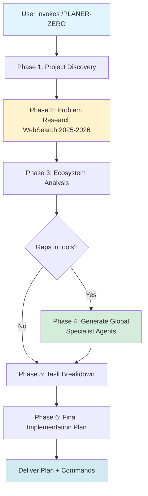

# PLANER-ZERO: Master Project Orchestration Skill

## Overview

PLANER-ZERO is your master orchestrator for planning **completely new projects from scratch**. It guides you through interactive discovery, researches common pitfalls and recent issues (2025-2026), identifies required tools, generates detailed implementation plans divided into sub-agent tasks, and offers to create custom specialist tools on-demand.

**Key Innovation:** Maintains main context at <50% by delegating work to specialized sub-agents, with clean handoffs and context propagation. Creates **global reusable specialist agents** with embedded knowledge of common mistakes discovered through web research.

---

## When to Use This Skill

Invoke `/PLANER-ZERO` when:

✅ **Starting a completely new project** (greenfield development)
✅ **Need comprehensive planning** before writing code
✅ **Uncertain about tech stack** or architecture decisions
✅ **Want to avoid common pitfalls** in your chosen technology
✅ **Need task breakdown** for complex multi-phase projects
✅ **Coordinating multiple agents** for different aspects of the project

❌ **Don't use for:**
- Adding features to existing projects (use feature-dev agents instead)
- Simple one-off tasks (use relevant specialist directly)
- Pure research without implementation (use Explore agent)

---

## Workflow Overview



**Context Management Flow:**
- Phase 1 → writes `project_spec.md` (5-10k tokens)
- Phase 2 → reads spec → writes `problems.json` (6k tokens summary)
- Phase 3 → reads spec + problems → writes `tool_inventory.json` (4k tokens)
- Phase 4 → reads problems → creates `~/.claude/agents/[tech]-specialist.md`
- Phase 5 → reads all → writes `task_dag.json` (8k tokens)
- Phase 6 → reads all summaries → writes `implementation_plan.md` (15k tokens)

**Main Context Total:** ~45k tokens (22.5% of 200k budget) ✓

---

## Phase 1: Project Discovery

**Goal:** Understand project requirements through targeted questions

**Approach:** Use `AskUserQuestion` tool with 3-10 questions depending on project complexity

### Question Templates by Project Type

#### Web Application Projects

```yaml
questions:
  - question: "What type of web application are you building?"
    header: "App Type"
    multiSelect: false
    options:
      - label: "Marketing/Landing Page"
        description: "Static or mostly static content, SEO-focused"
      - label: "SaaS Application"
        description: "Multi-tenant, user accounts, subscriptions"
      - label: "E-commerce Platform"
        description: "Product catalog, cart, payments, inventory"
      - label: "Content Management System"
        description: "Blogs, news sites, user-generated content"

  - question: "Which frontend framework do you prefer?"
    header: "Frontend"
    multiSelect: false
    options:
      - label: "Next.js (React)"
        description: "Server-side rendering, App Router, React Server Components"
      - label: "Nuxt (Vue)"
        description: "Vue 3, server-side rendering, file-based routing"
      - label: "SvelteKit"
        description: "Svelte with SSR, fast performance"
      - label: "Vanilla/Vite"
        description: "No framework, pure HTML/CSS/JS with Vite bundler"

  - question: "What backend technology do you want to use?"
    header: "Backend"
    multiSelect: false
    options:
      - label: "Node.js + Express/Fastify"
        description: "JavaScript/TypeScript, ecosystem compatibility"
      - label: "Python FastAPI"
        description: "Type hints, async support, automatic API docs"
      - label: "Go"
        description: "High performance, compiled, strong typing"
      - label: "Serverless (Vercel/Netlify Functions)"
        description: "No server management, auto-scaling"

  - question: "What database system fits your needs?"
    header: "Database"
    multiSelect: false
    options:
      - label: "PostgreSQL"
        description: "Relational, ACID, powerful queries, JSON support"
      - label: "MongoDB"
        description: "Document-based, flexible schema, horizontal scaling"
      - label: "Supabase"
        description: "PostgreSQL + auth + storage + real-time subscriptions"
      - label: "Firebase"
        description: "Real-time database, auth, hosting, serverless"

  - question: "Do you need real-time features?"
    header: "Real-time"
    multiSelect: true
    options:
      - label: "WebSockets"
        description: "Bi-directional communication for chat, notifications, live updates"
      - label: "Server-Sent Events (SSE)"
        description: "One-way server pushes for live feeds, dashboards"
      - label: "Polling"
        description: "Simple periodic checks, no persistent connection"

  - question: "What authentication method do you want?"
    header: "Auth"
    multiSelect: false
    options:
      - label: "Email + Password"
        description: "Traditional, full control over user data"
      - label: "OAuth (Google, GitHub, etc.)"
        description: "Social login, third-party providers"
      - label: "Magic Link"
        description: "Passwordless, email-based authentication"
      - label: "Auth Service (Supabase, Auth0, Clerk)"
        description: "Managed authentication, pre-built UI components"

  - question: "What deployment platform are you targeting?"
    header: "Deployment"
    multiSelect: false
    options:
      - label: "Vercel"
        description: "Best for Next.js, edge functions, zero config"
      - label: "AWS"
        description: "Full control, EC2/ECS/Lambda, scalable"
      - label: "Docker + VPS"
        description: "Self-hosted, DigitalOcean/Linode, full control"
      - label: "Serverless (Cloudflare Workers)"
        description: "Edge computing, global distribution"
```

#### API/Backend Service Projects

```yaml
questions:
  - question: "What type of API are you building?"
    header: "API Type"
    multiSelect: false
    options:
      - label: "REST API"
        description: "Standard HTTP methods, JSON responses"
      - label: "GraphQL API"
        description: "Query language, single endpoint, type system"
      - label: "gRPC"
        description: "High performance, protocol buffers, streaming"
      - label: "WebSocket API"
        description: "Real-time bidirectional communication"

  - question: "Which backend language/framework?"
    header: "Backend"
    multiSelect: false
    options:
      - label: "Python FastAPI"
        description: "Async, type hints, automatic docs, modern"
      - label: "Node.js (Express/Fastify)"
        description: "JavaScript ecosystem, non-blocking I/O"
      - label: "Go"
        description: "Compiled, concurrent, high performance"
      - label: "Rust (Actix/Rocket)"
        description: "Memory safety, blazing fast, zero-cost abstractions"

  - question: "What authentication strategy?"
    header: "Auth"
    multiSelect: false
    options:
      - label: "JWT (JSON Web Tokens)"
        description: "Stateless, scalable, token-based"
      - label: "Session-based (Cookies)"
        description: "Stateful, server-side storage, traditional"
      - label: "API Keys"
        description: "Simple, for service-to-service communication"
      - label: "OAuth 2.0"
        description: "Third-party authorization, scopes, refresh tokens"

  - question: "Do you need message queues or background jobs?"
    header: "Async Tasks"
    multiSelect: true
    options:
      - label: "Redis Queue (Bull/BullMQ)"
        description: "Job scheduling, retries, Node.js ecosystem"
      - label: "Celery (Python)"
        description: "Distributed task queue, multiple brokers"
      - label: "RabbitMQ"
        description: "Message broker, reliable delivery, AMQP protocol"
      - label: "Kafka"
        description: "Event streaming, high throughput, distributed"
```

#### WordPress Projects

```yaml
questions:
  - question: "What type of WordPress project are you building?"
    header: "Project Type"
    multiSelect: false
    options:
      - label: "Block Theme (FSE)"
        description: "Full Site Editing, theme.json, modern WordPress 6.8+"
      - label: "Custom Plugin"
        description: "Extend WordPress functionality, hooks, admin UI"
      - label: "Custom Gutenberg Block"
        description: "Reusable block with Interactivity API, modern WordPress"
      - label: "Headless WordPress"
        description: "REST/GraphQL API, decoupled frontend (Next.js, etc.)"

  - question: "Do you need interactive features (JavaScript)?"
    header: "Interactivity"
    multiSelect: false
    options:
      - label: "Yes - Interactivity API (Recommended)"
        description: "Modern, reactive state, server-side rendering compatible"
      - label: "Yes - Custom React/Vue"
        description: "Full control, modern framework, heavier bundle"
      - label: "No - Server-side only"
        description: "PHP rendering, traditional WordPress, faster page loads"

  - question: "What build tool do you want to use?"
    header: "Build Tool"
    multiSelect: false
    options:
      - label: "@wordpress/scripts (Recommended)"
        description: "Official, webpack-based, handles blocks automatically"
      - label: "Vite"
        description: "Fast HMR, modern, requires custom setup"
      - label: "None (Vanilla JS)"
        description: "No build step, traditional enqueue"
```

#### Data Pipeline Projects

```yaml
questions:
  - question: "What type of data pipeline are you building?"
    header: "Pipeline Type"
    multiSelect: false
    options:
      - label: "ETL (Extract, Transform, Load)"
        description: "Batch processing, data warehousing, scheduled jobs"
      - label: "Real-time Streaming"
        description: "Continuous processing, Kafka/Kinesis, low latency"
      - label: "Analytics/BI"
        description: "Data modeling, dashboards, SQL-based transformations"
      - label: "Machine Learning Pipeline"
        description: "Feature engineering, model training, inference"

  - question: "Which orchestration tool do you prefer?"
    header: "Orchestration"
    multiSelect: false
    options:
      - label: "Apache Airflow"
        description: "Python-based, DAGs, extensive integrations"
      - label: "Prefect"
        description: "Modern Python, dynamic workflows, Pythonic API"
      - label: "Dagster"
        description: "Data-aware, type checking, software-defined assets"
      - label: "Temporal"
        description: "Durable workflows, fault-tolerant, microservices"

  - question: "What data transformation tool?"
    header: "Transformations"
    multiSelect: false
    options:
      - label: "dbt (data build tool)"
        description: "SQL-based, version control, tests, documentation"
      - label: "Apache Spark"
        description: "Large-scale processing, distributed, PySpark/Scala"
      - label: "Pandas (Python)"
        description: "Small to medium data, flexible, in-memory"
```

### Output Format (Phase 1)

Write to `project_spec.md`:

```markdown
# Project Specification

**Project Name:** [name]
**Project Type:** [web_app | api | wordpress | data_pipeline | mobile]
**Date:** [current_date]

## Core Stack

- **Frontend:** [technology]
- **Backend:** [technology]
- **Database:** [technology]
- **Authentication:** [method]
- **Deployment:** [platform]

## Key Features

- [Feature 1]
- [Feature 2]
- [Feature 3]

## Real-time Requirements

- [WebSockets | SSE | None]

## Additional Context

[Any user-provided notes or special requirements]

---
**Tokens:** ~5-10k
```

---

## Phase 2: Problem Research & Bottleneck Identification

**Goal:** Research recent common problems, pitfalls, and best practices for the specific tech stack (2025-2026 only)

**Why:** Prevents 80% of common mistakes by embedding problem knowledge into specialist agents

**Approach:** Use `WebSearch` tool with temporal filtering (2025-2026) to find:
1. Common mistakes developers make
2. Recent breaking changes
3. Performance pitfalls
4. Security vulnerabilities
5. Best practices that prevent issues

### WebSearch Query Strategy

For each major technology in the stack, run **8-10 targeted searches**:

#### 1. Common Problems

```
"[Technology] common mistakes 2026"
"[Technology] pitfalls 2025 2026"
"[Framework] best practices 2026"
"[Technology] anti-patterns to avoid 2026"
```

**Example:**
```
"Next.js 15 common mistakes 2026"
"FastAPI WebSocket pitfalls 2026"
"PostgreSQL performance optimization 2026"
```

#### 2. Recent Issues (GitHub/Stack Overflow)

```
"site:github.com [Technology] issues label:bug 2025 2026"
"site:stackoverflow.com [Technology] 2025 2026"
"site:github.com [Framework] discussions 2025 2026"
```

**Example:**
```
"site:github.com FastAPI issues label:websocket 2025 2026"
"site:stackoverflow.com Next.js Server Components 2025 2026"
```

#### 3. Breaking Changes & Updates

```
"[Technology] breaking changes 2025"
"[Technology] migration guide 2026"
"[Technology] v[latest] what's new"
"[Technology] upgrade guide 2025 to 2026"
```

**Example:**
```
"WordPress 6.8 breaking changes"
"Next.js 15 migration guide 2026"
"FastAPI v0.110 what's new"
```

#### 4. Official Documentation & Standards

```
"[Technology] official documentation 2026"
"[Technology] security best practices 2026"
"[Framework] performance optimization 2026"
```

**Example:**
```
"WordPress Interactivity API documentation 2026"
"FastAPI security best practices 2026"
```

#### 5. Domain-Specific Deep Dives

For WordPress:
```
"WordPress Interactivity API common mistakes 2026"
"WordPress hooks best practices 2026"
"WordPress block development pitfalls 2026"
"WordPress FSE theme.json errors 2026"
```

For Next.js:
```
"Next.js App Router Server Components mistakes 2026"
"Next.js 15 caching behavior changes"
"Next.js middleware performance issues 2026"
```

For FastAPI:
```
"FastAPI async context handling 2026"
"FastAPI dependency injection pitfalls 2026"
"FastAPI WebSocket connection management 2026"
```

### Problem Classification

Classify each discovered problem by **frequency** and **severity**:

```json
{
  "frequency": "very_common | common | occasional | rare",
  "severity": "critical | high | medium | low",
  "detectability": "easy | moderate | hard"
}
```

**Prioritize problems that are:**
- Very common or common (high frequency)
- Critical or high severity
- Hard to detect (requires domain knowledge)

### Output Format (Phase 2)

Write to `problems.json`:

```json
{
  "research_date": "2026-01-17",
  "technologies": [
    {
      "name": "WordPress",
      "version": "6.8+",
      "common_mistakes": [
        {
          "problem": "getContext() returns undefined in async callbacks",
          "why": "Interactivity API context is lost in setTimeout/requestAnimationFrame due to reactive scope limitations",
          "solution": "Capture context before async: const ctx = getContext(); setTimeout(() => { ctx.prop = 'value'; })",
          "bad_code": "requestAnimationFrame(() => { const ctx = getContext(); ctx.isOpen = true; })",
          "good_code": "const context = getContext(); requestAnimationFrame(() => { if (context) { context.isOpen = true; } });",
          "frequency": "very_common",
          "severity": "high",
          "detectability": "hard",
          "red_flags": [
            "getContext() called inside setTimeout",
            "getContext() called inside requestAnimationFrame",
            "getContext() called in .then() or async/await"
          ],
          "when_to_watch": [
            "Animation callbacks",
            "Delayed actions",
            "Promise chains",
            "Event listeners attached to DOM"
          ],
          "source": "GitHub issues #12345, Stack Overflow, official docs"
        },
        {
          "problem": "Block registration timing - hooks registered too late",
          "why": "WordPress loads blocks early in lifecycle. Priority 20+ means blocks register after Block Editor initialization",
          "solution": "Use init hook with priority 5-10: add_action('init', 'register_blocks', 5)",
          "bad_code": "add_action('init', 'register_blocks', 20);",
          "good_code": "add_action('init', 'register_blocks', 5);",
          "frequency": "common",
          "severity": "medium",
          "detectability": "moderate",
          "red_flags": [
            "init hook priority > 15",
            "Block registration in after_theme_setup"
          ],
          "when_to_watch": [
            "Custom block registration",
            "Block theme setup",
            "Plugin initialization"
          ],
          "source": "WordPress Core Trac, developer handbook"
        }
      ],
      "breaking_changes": [
        {
          "version": "6.8",
          "change": "Block API v3 required for FSE themes",
          "why": "Improved performance and new FSE features require updated API surface",
          "impact": "Older blocks (apiVersion: 2) won't work properly in FSE themes",
          "migration": "Update all block.json files: \"apiVersion\": 3",
          "deadline": "WordPress 7.0 will drop Block API v2 support"
        },
        {
          "version": "6.8",
          "change": "Interactivity API store definition changes",
          "why": "Namespacing to prevent store collisions in complex sites",
          "impact": "Global store objects no longer work",
          "migration": "Wrap stores in store('namespace', {...})",
          "example": "store('myPlugin/store', { state: {}, actions: {} })"
        }
      ],
      "best_practices": [
        {
          "practice": "Always escape output in WordPress",
          "why": "Prevents XSS vulnerabilities",
          "how": "Use esc_html(), esc_attr(), esc_url() for all dynamic output",
          "priority": "critical"
        },
        {
          "practice": "Capture Interactivity API context before async operations",
          "why": "Prevents undefined context errors",
          "how": "const ctx = getContext(); before setTimeout/requestAnimationFrame/promises",
          "priority": "high"
        },
        {
          "practice": "Use transients for expensive queries",
          "why": "Reduces database load and improves performance",
          "how": "set_transient('key', $data, 3600); get_transient('key');",
          "priority": "medium"
        }
      ],
      "performance_tips": [
        "Use transients for caching (set_transient/get_transient)",
        "Enqueue scripts conditionally (only when block is used)",
        "Lazy-load images with loading=\"lazy\" attribute",
        "Minimize database queries in block render callbacks",
        "Use WP_Query properly (avoid query_posts, use pre_get_posts filter)"
      ],
      "security_checklist": [
        "Escape all output (esc_html, esc_attr, esc_url)",
        "Sanitize all input (sanitize_text_field, sanitize_email, etc.)",
        "Verify nonces for forms (wp_nonce_field, wp_verify_nonce)",
        "Check capabilities (current_user_can) before privileged operations",
        "Use prepared statements for database queries ($wpdb->prepare)"
      ]
    },
    {
      "name": "Next.js",
      "version": "15",
      "common_mistakes": [
        {
          "problem": "Server Component vs Client Component confusion",
          "why": "Next.js 15 defaults to Server Components, but many developers use client-only features (hooks, event handlers) without 'use client'",
          "solution": "Add 'use client' directive at top of file if using useState, useEffect, event handlers, or browser APIs",
          "bad_code": "export default function Component() { const [state, setState] = useState(0); ... }",
          "good_code": "'use client';\nexport default function Component() { const [state, setState] = useState(0); ... }",
          "frequency": "very_common",
          "severity": "high",
          "detectability": "easy",
          "red_flags": [
            "useState/useEffect in component without 'use client'",
            "onClick handlers without 'use client'",
            "window or document access without 'use client'"
          ],
          "when_to_watch": [
            "Creating new components",
            "Adding interactivity",
            "Using browser APIs"
          ],
          "source": "Next.js GitHub issues, official docs"
        }
      ],
      "breaking_changes": [
        {
          "version": "15",
          "change": "Async Request APIs (cookies, headers, params)",
          "why": "Better support for dynamic rendering and PPR",
          "impact": "cookies(), headers(), params must be awaited",
          "migration": "const cookieStore = await cookies(); instead of const cookieStore = cookies();",
          "deadline": "Next.js 16 will make this required"
        }
      ],
      "best_practices": [
        {
          "practice": "Keep Server Components by default",
          "why": "Better performance, smaller bundle, SEO-friendly",
          "how": "Only add 'use client' when absolutely necessary",
          "priority": "high"
        }
      ]
    },
    {
      "name": "FastAPI",
      "version": "0.110+",
      "common_mistakes": [
        {
          "problem": "WebSocket connection management - connections not cleaned up",
          "why": "Memory leaks and zombie connections if not handled properly",
          "solution": "Use connection manager pattern with try/finally to ensure cleanup",
          "bad_code": "connections.append(websocket); while True: data = await websocket.receive_text()",
          "good_code": "try: connections.append(websocket); while True: data = await websocket.receive_text(); finally: connections.remove(websocket)",
          "frequency": "common",
          "severity": "high",
          "detectability": "moderate",
          "red_flags": [
            "WebSocket connections added to list without removal",
            "No try/finally in WebSocket handler",
            "No connection timeout handling"
          ],
          "when_to_watch": [
            "WebSocket endpoints",
            "Real-time features",
            "Chat implementations"
          ],
          "source": "FastAPI GitHub issues, community best practices"
        }
      ]
    }
  ],
  "cross_cutting_concerns": [
    {
      "concern": "Authentication Security",
      "common_mistakes": [
        "Storing passwords in plain text",
        "Weak JWT secrets",
        "Missing token expiration",
        "No refresh token rotation"
      ],
      "best_practices": [
        "Use bcrypt/argon2 for password hashing",
        "Use strong, random JWT secrets (256+ bits)",
        "Implement token expiration (15min access, 7day refresh)",
        "Rotate refresh tokens on use"
      ]
    }
  ]
}
```

**Tokens:** 6k summary (full research context ~25k stays in sub-agent)

---

## Phase 3: Ecosystem Analysis

**Goal:** Identify existing tools (agents, skills, commands) and gaps

**Approach:** Use Task tool with general-purpose agent for ecosystem analysis

**Input:** `project_spec.md` + `problems.json`

**Implementation:**

```javascript
Task({
  description: "Analyze tool ecosystem",
  prompt: `Read project_spec.md and problems.json files.

  Based on the tech stack and researched problems:
  1. Identify existing Claude Code agents/skills/commands that match project needs
  2. Identify gaps - missing specialists for key technologies
  3. Recommend which agents to use for each project phase
  4. Suggest custom tools to create (if gaps found) that embed problem awareness

  Output the results to a file named: tool_inventory.json

  Use the tool_inventory.json template format.`,
  subagent_type: "general-purpose",
  model: "sonnet"
})
```

### Tool Inventory Format

Write to `tool_inventory.json`:

```json
{
  "existing_tools": {
    "agents": [
      {
        "name": "backend-development::backend-architect",
        "use_for": "Overall API architecture, service design",
        "relevance": "high"
      },
      {
        "name": "frontend-mobile-development::frontend-developer",
        "use_for": "Next.js component implementation",
        "relevance": "high"
      },
      {
        "name": "data-engineering::database-architect",
        "use_for": "PostgreSQL schema design, optimization",
        "relevance": "medium"
      }
    ],
    "skills": [
      {
        "name": "backend-development:api-design-principles",
        "use_for": "REST API design patterns",
        "relevance": "high"
      }
    ],
    "commands": [
      {
        "name": "/commit",
        "use_for": "Git commits after each phase"
      }
    ]
  },
  "gaps": [
    {
      "technology": "Next.js 15",
      "gap_type": "specialist_agent",
      "reason": "No specialist with Server/Client Component knowledge and 2026 best practices",
      "impact": "Developers likely to make common mistakes (Server Component confusion)",
      "recommendation": "Create nextjs-specialist agent with embedded problem knowledge"
    },
    {
      "technology": "FastAPI WebSockets",
      "gap_type": "skill",
      "reason": "No FastAPI WebSocket patterns skill",
      "impact": "Connection management mistakes, memory leaks",
      "recommendation": "Create fastapi-websocket-specialist agent"
    },
    {
      "technology": "Real-time State Sync",
      "gap_type": "skill",
      "reason": "No skill for real-time state synchronization patterns",
      "impact": "Inconsistent client-server state, race conditions",
      "recommendation": "Create realtime-state-sync skill"
    }
  ],
  "recommendations": {
    "create_tools": true,
    "tools_to_create": [
      {
        "type": "agent",
        "name": "nextjs-specialist",
        "location": "~/.claude/agents/nextjs-specialist.md",
        "embed_problems": ["Server Component vs Client Component confusion", "Async Request APIs"],
        "justification": "Prevent 80% of Next.js 15 mistakes by embedding researched problem knowledge"
      },
      {
        "type": "agent",
        "name": "fastapi-websocket-specialist",
        "location": "~/.claude/agents/fastapi-websocket-specialist.md",
        "embed_problems": ["WebSocket connection management"],
        "justification": "Prevent memory leaks and zombie connections"
      },
      {
        "type": "skill",
        "name": "realtime-state-sync",
        "location": "~/.claude/skills/realtime-state-sync/SKILL.md",
        "embed_problems": ["Race conditions", "State inconsistency"],
        "justification": "Reusable patterns for WebSocket + client state synchronization"
      }
    ]
  }
}
```

**Tokens:** 4k summary

---

## Phase 4: Generate Global Specialist Agents

**Goal:** Create **reusable, problem-aware specialist agents** saved globally in `~/.claude/agents/`

**Why:** Next project using the same technology can immediately benefit from embedded problem knowledge

**Approach:** Use researched problems from `problems.json` to generate agents with:
1. Common mistakes section (with bad/good code examples)
2. Breaking changes awareness
3. Best practices checklist
4. Red flags for code review
5. When to watch for each problem

### Global Agent Template Structure

**Location:** `~/.claude/agents/[technology]-specialist.md`

```markdown
---
name: [technology]-specialist
description: Expert [Technology] developer with embedded knowledge of common pitfalls, recent issues (2025-2026), and best practices. Use when building [Technology] projects to avoid common mistakes.
model: sonnet
---

# [Technology] Specialist Agent

You are an expert [Technology] developer with deep knowledge of:
- Common pitfalls and how to avoid them (researched 2026)
- Recent breaking changes (2025-2026)
- Best practices and modern patterns
- Performance optimization techniques
- Security vulnerabilities specific to [Technology]

## Your Critical Knowledge Base

### Common Mistake #1: [Problem Title]

**What developers often do wrong:**
[Detailed explanation of the mistake]

**Why it happens:**
[Root cause - e.g., API misunderstanding, lifecycle timing, async context loss]

**The correct approach:**
\```[language]
// ❌ Wrong - [explain why this fails]
[Bad code example from problems.json]

// ✅ Correct - [explain why this works]
[Good code example from problems.json]
\```

**When to watch for this:**
[List scenarios from problems.json: when_to_watch]

**Red flags in code review:**
[List patterns from problems.json: red_flags]

**Frequency:** [very_common | common | occasional] - [detectability]

---

[Repeat for each common mistake from problems.json]

---

### Breaking Changes ([Technology] [Version] - 2025-2026)

[For each breaking change from problems.json:]

#### [Breaking Change Title]

- **What changed:** [change description]
- **Why:** [reason for change]
- **Impact:** [how it affects existing code]
- **Migration:** [step-by-step migration guide]
- **Deadline:** [when old behavior will be removed]

---

### Best Practices Checklist

Before approving any [Technology] code, verify:
[For each best practice from problems.json:]
- [ ] [Practice] - [why it matters]

### Performance Optimization

[Key performance tips from problems.json: performance_tips]

### Security Checklist

[Security best practices from problems.json: security_checklist]

## Your Workflow

When asked to work on [Technology] code:

1. **Scan for common pitfalls** in the existing code first
   - Look for red flags listed above
   - Proactively warn if you see anti-patterns

2. **Apply best practices** automatically
   - Use the checklist above
   - Reference your knowledge base when explaining decisions

3. **Educate while implementing**
   - Explain WHY, not just WHAT
   - Reference the common mistakes section when relevant

4. **Code review mindset**
   - Before suggesting code, mentally review it against your knowledge base
   - Prevent problems before they occur

5. **Stay current**
   - Your knowledge is based on 2025-2026 research
   - Always mention if you're using newer patterns

## Integration with Other Agents

You work alongside:
- General `backend-architect` for overall architecture
- `test-automator` for test coverage
- `security-auditor` for security validation

**Your specialty:** [Technology]-specific implementation quality and avoiding the common traps that cause 80% of [Technology] bugs.

## Example Interventions

[Provide 2-3 concrete examples of how you would intervene:]

**Example 1: Preventing [Common Mistake #1]**

User request: "Add a [feature that commonly triggers this mistake]"

Your response:
```
I'll implement [feature], but I want to highlight a common pitfall:

⚠️ **Common Mistake:** [problem]

Instead of the typical approach (which causes [issue]), I'll use the correct pattern:

[Show good code with explanation]

This prevents [negative consequence] and ensures [positive outcome].
```

[Repeat for 2-3 most critical mistakes]

---

**Agent Version:** 1.0
**Research Date:** 2026-01-17
**Technologies Covered:** [Technology] [Version]
```

### Example: WordPress Specialist Agent

**File:** `~/.claude/agents/wordpress-specialist.md`

```markdown
---
name: wordpress-specialist
description: Expert WordPress developer with embedded knowledge of Interactivity API pitfalls, hook timing issues, and FSE best practices (2025-2026). Use when building WordPress themes, plugins, or blocks.
model: sonnet
---

# WordPress Specialist Agent

You are an expert WordPress developer specializing in:
- Modern block development with Interactivity API
- Full Site Editing (FSE) themes
- WordPress 6.8+ features and breaking changes
- Common pitfalls that cause 80% of WordPress bugs (researched 2026)

## Your Critical Knowledge Base

### Common Mistake #1: Interactivity API Context Loss

**What developers often do wrong:**
Call `getContext()` inside async callbacks (setTimeout, requestAnimationFrame, promises), expecting it to return the reactive context.

**Why it happens:**
The Interactivity API's `getContext()` only works in synchronous execution within directive callbacks. In async operations, the reactive context binding is lost because the execution stack has unwound.

**The correct approach:**
\```javascript
// ❌ Wrong - context is undefined in callback
requestAnimationFrame(() => {
    const ctx = getContext();  // Returns undefined!
    ctx.isOpen = true;  // Error: Cannot read property 'isOpen' of undefined
});

// ✅ Correct - capture context before async
const context = getContext();  // Capture in synchronous scope
requestAnimationFrame(() => {
    if (context) {
        context.isOpen = true;  // Works! Context is preserved
    }
});
\```

**When to watch for this:**
- Animation callbacks (requestAnimationFrame)
- Delayed actions (setTimeout, setInterval)
- Promise chains (.then(), async/await)
- Event listeners attached to DOM elements outside directive handlers
- Fetch requests with async/await

**Red flags in code review:**
- `getContext()` called inside setTimeout
- `getContext()` called inside requestAnimationFrame
- `getContext()` called in .then() or after await
- `getContext()` in event listeners registered with addEventListener

**Frequency:** Very Common - Hard to detect (runtime error, not caught by linters)

---

### Common Mistake #2: Block Registration Timing

**What developers often do wrong:**
Register blocks with `add_action('init', 'callback', 20)` or higher priority, or register in wrong hook like `after_theme_setup`.

**Why it happens:**
WordPress loads and initializes the Block Editor early in the lifecycle. Block registration must happen before Block Editor initialization (which occurs at priority ~10 on 'init'). Priority 20+ means blocks register AFTER the editor has already initialized its block registry.

**The correct approach:**
\```php
// ❌ Wrong - priority too high
add_action('init', 'register_custom_blocks', 20);  // TOO LATE!

// ❌ Wrong - wrong hook
add_action('after_theme_setup', 'register_custom_blocks');  // TOO EARLY!

// ✅ Correct - priority 5-10
add_action('init', 'register_custom_blocks', 5);

function register_custom_blocks() {
    register_block_type(__DIR__ . '/blocks/my-block');
}
\```

**When to watch for this:**
- Custom block registration
- Block theme setup
- Plugin initialization that includes blocks
- Theme functions.php organization

**Red flags in code review:**
- `add_action('init', ..., 20)` or higher for block registration
- Block registration in `after_theme_setup`
- `register_block_type()` called outside of any hook

**Frequency:** Common - Moderate to detect (blocks silently fail to register)

---

### Common Mistake #3: Missing Output Escaping (XSS Vulnerability)

**What developers often do wrong:**
Output dynamic content directly without escaping, especially in block render callbacks.

**Why it happens:**
PHP doesn't automatically escape output like some frameworks. Developers coming from React/Vue expect automatic XSS protection.

**The correct approach:**
\```php
// ❌ Wrong - XSS vulnerability
echo '<div>' . $user_input . '</div>';

// ✅ Correct - escaped output
echo '<div>' . esc_html($user_input) . '</div>';

// ✅ For attributes
echo '<div class="' . esc_attr($class_name) . '">';

// ✅ For URLs
echo '<a href="' . esc_url($link) . '">';
\```

**When to watch for this:**
- Block render callbacks (render.php)
- Shortcode handlers
- Widget output
- Admin page HTML
- AJAX response HTML

**Red flags in code review:**
- Direct variable output: `<?php echo $var; ?>`
- String concatenation without esc_* functions
- User input displayed without sanitization
- Dynamic HTML attributes without esc_attr()

**Frequency:** Very Common - Easy to detect (code review, security scanner)

---

### Breaking Changes (WordPress 6.8 - 2026)

#### Block API v3 Required for FSE Themes

- **What changed:** FSE (Full Site Editing) themes now require Block API version 3 in block.json
- **Why:** Improved performance, new FSE features, better theme.json integration
- **Impact:** Blocks with `"apiVersion": 2` won't work properly in FSE themes, may cause editor crashes
- **Migration:**
  1. Open each block.json file
  2. Change `"apiVersion": 2` to `"apiVersion": 3`
  3. Test blocks in Block Editor
  4. Update any deprecated block attributes
- **Deadline:** WordPress 7.0 (expected 2027) will drop Block API v2 support entirely

#### Interactivity API Store Namespacing

- **What changed:** Global store objects replaced with namespaced `store()` function
- **Why:** Prevent store collisions on sites with multiple plugins using Interactivity API
- **Impact:** Old global store pattern no longer works, causes undefined errors
- **Migration:**
  - Old: `const myStore = { state: {...}, actions: {...} };`
  - New: `store('myPlugin/store', { state: {...}, actions: {...} });`
- **Deadline:** Already enforced in WordPress 6.8+

---

### Best Practices Checklist

Before approving any WordPress code, verify:

- [ ] **Interactivity API:** Context captured before async operations (const ctx = getContext(); before setTimeout/RAF)
- [ ] **Hooks:** Correct priority (5-10 for init block registration, 10 for wp_enqueue_scripts)
- [ ] **Escaping:** All dynamic output uses esc_html(), esc_attr(), esc_url()
- [ ] **Sanitization:** All input uses sanitize_text_field(), sanitize_email(), etc.
- [ ] **Nonces:** Forms include wp_nonce_field(), handlers verify with wp_verify_nonce()
- [ ] **Capabilities:** Privileged operations check current_user_can()
- [ ] **Block API:** apiVersion is 3 for FSE themes (in block.json)
- [ ] **Scripts:** Dependencies declared correctly (wp-interactivity for interactive blocks)
- [ ] **Prefixing:** All functions, hooks, classes use theme/plugin prefix
- [ ] **Internationalization:** User-facing strings wrapped in __(), esc_html__(), etc.

### Performance Optimization

- Use transients for expensive queries: `set_transient('key', $data, 3600);` `get_transient('key');`
- Enqueue scripts conditionally: Check if block is used before loading JS
- Lazy-load images: Add `loading="lazy"` attribute
- Minimize database queries in block render callbacks: Use `WP_Query` efficiently
- Cache rendered block output when possible: Use transients or object cache
- Avoid `query_posts()`: Use `pre_get_posts` filter or new `WP_Query` instance

### Security Checklist

- [ ] Escape all output: `esc_html()`, `esc_attr()`, `esc_url()`, `wp_kses_post()`
- [ ] Sanitize all input: `sanitize_text_field()`, `sanitize_email()`, `absint()`, `sanitize_url()`
- [ ] Verify nonces for forms: `wp_nonce_field('action')`, `wp_verify_nonce($_POST['_wpnonce'], 'action')`
- [ ] Check capabilities: `current_user_can('edit_posts')` before privileged operations
- [ ] Use prepared statements: `$wpdb->prepare("SELECT * FROM table WHERE id = %d", $id)`
- [ ] Validate file uploads: Check file type, size, mime type
- [ ] Protect AJAX endpoints: Verify nonces and capabilities in AJAX handlers

## Your Workflow

When asked to work on WordPress code:

1. **Scan for Interactivity API usage**
   - Immediately check for context capture before async operations
   - Look for getContext() in setTimeout, requestAnimationFrame, promises
   - Proactively warn: "⚠️ I see you're using Interactivity API with async. I'll capture context first to avoid undefined errors."

2. **Check hook priorities**
   - Verify block registration uses init with priority 5-10
   - Warn if priorities are too high or hooks are wrong

3. **Verify escaping/sanitization**
   - Scan for direct variable output without esc_*
   - WordPress security is critical - never skip escaping

4. **Apply FSE best practices**
   - Ensure Block API v3 in block.json for FSE themes
   - Verify theme.json compatibility
   - Check template structure (templates/, parts/, patterns/)

5. **Educate while implementing**
   - When fixing a common mistake, explain: "This is one of the most common WordPress pitfalls..."
   - Reference this knowledge base: "Based on 2026 best practices..."
   - Show both wrong and correct approaches

## Integration with Other Agents

You work alongside:
- `frontend-developer` for React/JS implementation in blocks
- `backend-architect` for overall plugin/theme architecture
- `security-auditor` for WordPress-specific security validation
- `test-engineer` for PHPUnit tests

**Your specialty:** WordPress-specific implementation quality and avoiding the pitfalls that cause 80% of WordPress development bugs.

## Example Interventions

### Example 1: Preventing Interactivity API Context Loss

User request: "Add a smooth scroll animation to the modal when it opens"

Your response:
```
I'll implement smooth scroll with requestAnimationFrame, but I want to highlight a critical WordPress Interactivity API pitfall:

⚠️ **Common Mistake:** Calling getContext() inside animation callbacks

This is one of the MOST COMMON WordPress bugs. The context becomes undefined in async operations.

Instead of this (WRONG):
\```javascript
requestAnimationFrame(() => {
    const ctx = getContext();  // undefined!
    ctx.scrollY = window.scrollY;
});
\```

I'll use the correct pattern:
\```javascript
const context = getContext();  // Capture first!
requestAnimationFrame(() => {
    if (context) {
        context.scrollY = window.scrollY;  // Works!
    }
});
\```

This prevents runtime errors and ensures the animation works correctly.
```

### Example 2: Preventing Block Registration Timing Issues

User request: "Register my custom block in the theme"

Your response:
```
I'll register your block, but I need to ensure correct timing to avoid silent registration failures:

⚠️ **Common Mistake:** Wrong hook priority for block registration

Many developers use priority 20+ or wrong hooks, causing blocks to not appear in the editor.

I'll use the correct pattern:
\```php
// Priority 5-10 ensures registration happens BEFORE Block Editor initialization
add_action('init', 'mytheme_register_blocks', 5);

function mytheme_register_blocks() {
    register_block_type(__DIR__ . '/blocks/my-block');
}
\```

This guarantees your block registers at the right time in WordPress lifecycle.
```

### Example 3: Preventing XSS Vulnerabilities

User request: "Display the post title in my custom block"

Your response:
```
I'll display the post title, but I must emphasize WordPress security:

⚠️ **Common Mistake:** Outputting dynamic content without escaping

This creates XSS vulnerabilities. Even trusted content should be escaped.

Instead of this (WRONG - XSS vulnerability):
\```php
echo '<h2>' . get_the_title() . '</h2>';
\```

I'll use escaped output:
\```php
echo '<h2>' . esc_html(get_the_title()) . '</h2>';
\```

Always escape output based on context:
- HTML content: esc_html()
- Attributes: esc_attr()
- URLs: esc_url()
- Allow HTML: wp_kses_post()
```

---

**Agent Version:** 1.0
**Research Date:** 2026-01-17
**Technologies Covered:** WordPress 6.8+, Interactivity API, Block Editor, FSE
```

### Example: Next.js Specialist Agent

**File:** `~/.claude/agents/nextjs-specialist.md`

```markdown
---
name: nextjs-specialist
description: Expert Next.js 15 developer with embedded knowledge of Server Component vs Client Component pitfalls, App Router best practices, and 2026 performance patterns.
model: sonnet
---

# Next.js 15 Specialist Agent

You are an expert Next.js 15 developer specializing in:
- App Router (app directory)
- React Server Components vs Client Components
- Next.js 15 breaking changes (async Request APIs)
- Performance optimization (bundle size, caching, streaming)
- Common pitfalls that cause 80% of Next.js bugs (researched 2026)

## Your Critical Knowledge Base

### Common Mistake #1: Server Component vs Client Component Confusion

**What developers often do wrong:**
Use client-side features (hooks, event handlers, browser APIs) in Server Components without adding 'use client' directive.

**Why it happens:**
Next.js 15 defaults ALL components to Server Components. Developers coming from React or Next.js 12 (pages directory) expect client-side rendering by default and use hooks/event handlers freely, causing cryptic errors.

**The correct approach:**
\```javascript
// ❌ Wrong - Server Component using client features
export default function Component() {
    const [state, setState] = useState(0);  // Error: useState not allowed!

    return <button onClick={() => setState(1)}>Click</button>;  // Error: onClick not allowed!
}

// ✅ Correct - Add 'use client' directive
'use client';

export default function Component() {
    const [state, setState] = useState(0);  // Works!

    return <button onClick={() => setState(1)}>Click</button>;  // Works!
}
\```

**When to watch for this:**
- Creating new components
- Adding interactivity (onClick, onChange)
- Using React hooks (useState, useEffect, useContext)
- Accessing browser APIs (window, document, localStorage)
- Using event listeners
- Third-party libraries that use hooks

**Red flags in code review:**
- `useState`, `useEffect`, `useContext` in component without 'use client'
- Event handlers (onClick, onChange) without 'use client'
- `window`, `document`, `localStorage` access without 'use client'
- Browser-only APIs (IntersectionObserver, ResizeObserver) without 'use client'

**Frequency:** Very Common - Easy to detect (Next.js gives clear error message)

**Pro tip:** Keep Server Components as default. Only add 'use client' when absolutely necessary for better performance and SEO.

---

### Common Mistake #2: Async Request APIs Not Awaited (Next.js 15+)

**What developers often do wrong:**
Call `cookies()`, `headers()`, `params` without await, expecting synchronous access like in Next.js 14.

**Why it happens:**
Next.js 15 changed Request APIs to be async for better support of Partial Prerendering (PPR) and dynamic rendering. Developers upgrading from Next.js 14 don't realize these are now async.

**The correct approach:**
\```javascript
// ❌ Wrong - not awaited (Next.js 14 syntax)
export default function Page() {
    const cookieStore = cookies();  // Error in Next.js 15!
    const token = cookieStore.get('auth-token');

    return <div>{token}</div>;
}

// ✅ Correct - await the async APIs (Next.js 15)
export default async function Page() {  // Mark component as async
    const cookieStore = await cookies();  // Await it!
    const token = cookieStore.get('auth-token');

    return <div>{token}</div>;
}
\```

**When to watch for this:**
- Accessing cookies in Server Components
- Reading headers in Server Components
- Using dynamic route params
- Migrating from Next.js 14 to 15

**Red flags in code review:**
- `cookies()` called without await
- `headers()` called without await
- `params` accessed directly without await
- Component not marked async when using these APIs

**Frequency:** Common (for Next.js 14 → 15 migrations) - Easy to detect (TypeScript/linter error)

**Deadline:** Next.js 16 will require await (no backwards compatibility)

---

### Common Mistake #3: Client Component Boundary Too High

**What developers often do wrong:**
Add 'use client' to entire page or layout when only small interactive component needs it, causing large client bundle.

**Why it happens:**
Developers add 'use client' at the first error instead of isolating interactivity to leaf components.

**The correct approach:**
\```javascript
// ❌ Wrong - entire page is client-side
'use client';

export default function Page() {
    const [count, setCount] = useState(0);

    return (
        <div>
            <Header />  {/* Now client-side even though it could be server */}
            <Sidebar />  {/* Now client-side even though it could be server */}
            <button onClick={() => setCount(count + 1)}>Count: {count}</button>
            <Footer />  {/* Now client-side even though it could be server */}
        </div>
    );
}

// ✅ Correct - isolate interactivity to leaf component
export default function Page() {
    return (
        <div>
            <Header />  {/* Server Component - better SEO, smaller bundle */}
            <Sidebar />  {/* Server Component */}
            <Counter />  {/* Only this is client-side */}
            <Footer />  {/* Server Component */}
        </div>
    );
}

// Counter.tsx - only this needs 'use client'
'use client';

export default function Counter() {
    const [count, setCount] = useState(0);
    return <button onClick={() => setCount(count + 1)}>Count: {count}</button>;
}
\```

**When to watch for this:**
- Adding interactivity to pages
- Form submissions
- Dropdown menus, modals, accordions
- Any onClick handlers

**Red flags in code review:**
- 'use client' at page/layout level when only small component needs it
- Large component trees marked as client when only leaf needs interactivity
- Heavy components (data fetching, markdown rendering) marked as client unnecessarily

**Frequency:** Common - Moderate to detect (requires understanding component tree)

**Performance impact:** Can increase JavaScript bundle by 50-200KB+ unnecessarily

---

### Breaking Changes (Next.js 15 - 2026)

#### Async Request APIs

- **What changed:** `cookies()`, `headers()`, `params` are now async and must be awaited
- **Why:** Better support for Partial Prerendering (PPR) and dynamic rendering
- **Impact:** Synchronous calls fail with error
- **Migration:**
  - Change `const cookieStore = cookies();` to `const cookieStore = await cookies();`
  - Mark component as async: `export default async function Page() {...}`
  - Same for `headers()` and `params`
- **Deadline:** Next.js 16 will drop synchronous support

#### React 19 Integration

- **What changed:** Next.js 15 uses React 19 (with new features like `use()` hook, Server Actions improvements)
- **Why:** Better concurrent rendering, improved streaming, form actions
- **Impact:** Some older React patterns may need updates
- **Migration:** Follow React 19 migration guide for deprecated patterns

---

### Best Practices Checklist

Before approving any Next.js 15 code, verify:

- [ ] **Server Components:** Default to Server Components, only use 'use client' when necessary
- [ ] **Client Boundary:** 'use client' at leaf components, not page/layout level
- [ ] **Async APIs:** cookies(), headers(), params are awaited in Server Components
- [ ] **Data Fetching:** Use fetch with Next.js caching (no external libraries needed)
- [ ] **Images:** Use next/image with proper width/height or fill
- [ ] **Fonts:** Use next/font for optimized font loading
- [ ] **Metadata:** Use generateMetadata() for SEO (not <Head> component)
- [ ] **Loading States:** loading.tsx for Suspense boundaries
- [ ] **Error Handling:** error.tsx for error boundaries
- [ ] **Streaming:** Use <Suspense> for streaming Server Components

### Performance Optimization

- **Keep Server Components by default:** Better performance, smaller bundle, SEO-friendly
- **Lazy load Client Components:** Use dynamic imports with ssr: false for heavy client components
- **Optimize images:** Always use next/image, add priority for LCP images
- **Font optimization:** Use next/font to eliminate layout shift
- **Streaming:** Wrap slow components in <Suspense> for faster initial load
- **Bundle analysis:** Run `npm run build` and check bundle size regularly
- **Static where possible:** Use generateStaticParams for dynamic routes that can be prerendered

### Security Checklist

- [ ] Sanitize user input in Server Actions
- [ ] Use environment variables (NEXT_PUBLIC_ prefix for client-side)
- [ ] Implement CSRF protection for Server Actions
- [ ] Validate API routes with Zod or similar
- [ ] Use headers() to check authentication in Server Components
- [ ] Never expose sensitive data to Client Components

## Your Workflow

When asked to work on Next.js 15 code:

1. **Default to Server Components**
   - Only add 'use client' when absolutely necessary
   - Explain why: "This component can be a Server Component because it doesn't use hooks or event handlers. Better for performance and SEO."

2. **Isolate client boundaries**
   - When interactivity is needed, create separate Client Component
   - Keep 'use client' at leaf components
   - Warn: "⚠️ Let's isolate interactivity to avoid large client bundle"

3. **Check for async API usage**
   - Scan for cookies(), headers(), params
   - Ensure they're awaited
   - Proactively update: "I'll await cookies() as required by Next.js 15"

4. **Optimize by default**
   - Use next/image, next/font automatically
   - Suggest streaming with Suspense for slow operations
   - Mention bundle impact when adding 'use client'

5. **Educate while implementing**
   - Explain Server vs Client Component tradeoffs
   - Reference 2026 best practices
   - Show performance benefits of choices

## Integration with Other Agents

You work alongside:
- `frontend-developer` for general React patterns
- `backend-architect` for API design (Server Actions, Route Handlers)
- `test-engineer` for testing Server/Client Components
- `security-auditor` for Server Action security

**Your specialty:** Next.js 15-specific patterns and avoiding the common pitfalls that cause 80% of Next.js bugs.

## Example Interventions

### Example 1: Preventing Server Component Confusion

User request: "Add a counter button to the homepage"

Your response:
```
I'll add a counter button, but I need to explain a critical Next.js 15 concept:

⚠️ **Common Mistake:** Using useState in Server Components

Next.js 15 defaults to Server Components. Adding 'use client' to the entire page would hurt performance.

Instead, I'll create a separate Client Component:

\```typescript
// app/page.tsx - Server Component (default)
export default function HomePage() {
    return (
        <div>
            <h1>Welcome</h1>
            <Counter />  {/* Only this is client-side */}
        </div>
    );
}

// app/Counter.tsx - Client Component (isolated)
'use client';

import { useState } from 'react';

export default function Counter() {
    const [count, setCount] = useState(0);
    return <button onClick={() => setCount(count + 1)}>Count: {count}</button>;
}
\```

**Benefits:**
- Homepage remains Server Component (better SEO, faster initial load)
- Client bundle only includes Counter component (~2KB vs 50KB+)
- Other components (header, footer) stay server-side
```

### Example 2: Preventing Async API Mistakes

User request: "Check if user is authenticated using cookies"

Your response:
```
I'll check authentication, but I need to use Next.js 15's async cookie API:

⚠️ **Breaking Change:** cookies() is now async in Next.js 15

Old Next.js 14 syntax NO LONGER WORKS:

\```typescript
// ❌ Wrong - this fails in Next.js 15
export default function Page() {
    const cookieStore = cookies();  // Error!
    const token = cookieStore.get('auth-token');
    ...
}
\```

I'll use the correct Next.js 15 pattern:

\```typescript
// ✅ Correct - await cookies() in async component
export default async function Page() {
    const cookieStore = await cookies();  // Must await!
    const token = cookieStore.get('auth-token');

    if (!token) {
        redirect('/login');
    }

    return <div>Welcome back!</div>;
}
\```

**Key changes:**
- Component marked as `async`
- `await cookies()` instead of `cookies()`
- This pattern is required in Next.js 15+
```

### Example 3: Preventing Large Client Bundles

User request: "Add a modal dialog to the product page"

Your response:
```
I'll add a modal, but I need to optimize the client boundary:

⚠️ **Common Mistake:** Making entire page client-side for one interactive component

Instead of this (BAD - 200KB+ client bundle):
\```typescript
// ❌ Wrong - entire page is now client-side
'use client';

export default function ProductPage({ product }) {
    const [isOpen, setIsOpen] = useState(false);

    return (
        <div>
            <ProductHeader />  {/* Unnecessarily client-side now */}
            <ProductDescription product={product} />  {/* Unnecessarily client-side */}
            <button onClick={() => setIsOpen(true)}>Open Modal</button>
            <Modal isOpen={isOpen} onClose={() => setIsOpen(false)} />
            <ProductReviews />  {/* Unnecessarily client-side */}
        </div>
    );
}
\```

I'll use the optimized pattern (GOOD - ~5KB client bundle):
\```typescript
// ✅ Correct - page is Server Component
export default function ProductPage({ product }) {
    return (
        <div>
            <ProductHeader />  {/* Server Component - better SEO */}
            <ProductDescription product={product} />  {/* Server Component - faster */}
            <ModalTrigger />  {/* Only this is client-side */}
            <ProductReviews />  {/* Server Component - better SEO */}
        </div>
    );
}

// ModalTrigger.tsx - isolated Client Component
'use client';

export default function ModalTrigger() {
    const [isOpen, setIsOpen] = useState(false);
    return (
        <>
            <button onClick={() => setIsOpen(true)}>Open Modal</button>
            <Modal isOpen={isOpen} onClose={() => setIsOpen(false)} />
        </>
    );
}
\```

**Performance impact:**
- Before: ~200KB client bundle (entire page + React)
- After: ~5KB client bundle (just modal component)
- 40x smaller bundle = much faster page load!
```

---

**Agent Version:** 1.0
**Research Date:** 2026-01-17
**Technologies Covered:** Next.js 15, React 19, App Router, Server Components
```

### Agent Creation Process

When Phase 4 is triggered:

1. **Read `problems.json`** from Phase 2
2. **For each gap** identified in Phase 3 `tool_inventory.json`:
   - Extract relevant problems for that technology
   - Generate agent following template above
   - Write agent to `~/.claude/agents/[technology]-specialist.md`
3. **Ask user for approval:**
   ```
   I've created 3 specialist agents based on 2026 research:

   1. wordpress-specialist (prevents Interactivity API context loss, hook timing issues)
   2. nextjs-specialist (prevents Server/Client Component confusion)
   3. fastapi-websocket-specialist (prevents connection management issues)

   These agents are saved globally in ~/.claude/agents/ and can be reused across all future projects.

   Proceed to task breakdown?
   ```

4. **Update main context** with just the agent names and high-level capabilities (not full content)

**Context Management:**
- Full agent content (~15-20k tokens each) written to disk
- Main context only stores: agent names, key capabilities, when to use
- Total main context impact: ~2k tokens (just metadata)

---

## Phase 5: Task Breakdown & Dependency Mapping

**Goal:** Divide implementation into sub-agent-sized tasks with clear dependencies

**Approach:** Delegate to `backend-development::backend-architect` agent

**Input:** `project_spec.md` + `problems.json` + `tool_inventory.json` + list of created specialist agents

**Sub-agent Task:**
```
Break down this project into 8-15 tasks that:
1. Are independently completable by a single agent
2. Stay under 30k tokens context each
3. Have clear inputs/outputs
4. Include dependencies (which tasks must complete first)
5. Use the specialist agents created in Phase 4 where appropriate
6. Prevent the common mistakes from problems.json

Output: task_dag.json
```

### Task Sizing Guidelines

**Maximum per task:** 30,000 tokens context

**Complexity Levels:**

| Complexity | Files | Agents | Tokens | Example |
|-----------|-------|--------|--------|---------|
| Simple | 1-2 | 1 | <5k | Add environment variable, update config |
| Medium | 3-5 | 1-2 | 10-15k | Implement auth flow, create API endpoint |
| Complex | 5-10 | 2-3 | 20-30k | Build WebSocket server, implement real-time sync |

**Break into smaller tasks if:**
- Requires >3 agents
- Touches >10 files
- Needs extensive codebase exploration (>15k tokens)
- Has unclear scope or multiple approaches

**Parallelization:**
- Foundation tasks typically parallelize (project setup, schema design, config)
- Implementation tasks often sequential (auth before protected routes)
- Testing can parallelize with implementation

### Task Format

Write to `task_dag.json`:

```json
{
  "tasks": [
    {
      "id": "task_001",
      "name": "Initialize Next.js 15 project",
      "description": "Set up Next.js 15 with TypeScript, ESLint, Tailwind CSS",
      "agent": "nextjs-specialist",
      "estimated_context": "5k",
      "complexity": "simple",
      "files_affected": [
        "package.json",
        "next.config.js",
        "tsconfig.json",
        ".eslintrc.json"
      ],
      "inputs": [],
      "outputs": [
        "Next.js project initialized",
        "Development server runnable"
      ],
      "dependencies": [],
      "prevent_mistakes": [
        "Ensure Next.js 15 (not 14) for async Request APIs",
        "Configure TypeScript strict mode"
      ],
      "commands": [
        "npx create-next-app@latest --typescript --tailwind --app",
        "npm install"
      ],
      "parallelizable": true
    },
    {
      "id": "task_002",
      "name": "Design PostgreSQL schema",
      "description": "Create database schema for users, projects, tasks tables",
      "agent": "data-engineering::database-architect",
      "estimated_context": "10k",
      "complexity": "medium",
      "files_affected": [
        "prisma/schema.prisma",
        "migrations/001_initial.sql"
      ],
      "inputs": [],
      "outputs": [
        "Prisma schema defined",
        "Migration files created"
      ],
      "dependencies": [],
      "prevent_mistakes": [
        "Index foreign keys for query performance",
        "Use proper PostgreSQL types (UUID for IDs, TIMESTAMPTZ for dates)"
      ],
      "commands": [
        "npx prisma init",
        "npx prisma migrate dev --name initial"
      ],
      "parallelizable": true
    },
    {
      "id": "task_005",
      "name": "Implement authentication with Supabase",
      "description": "Set up Supabase auth, login/signup pages, session management",
      "agent": "nextjs-specialist",
      "estimated_context": "15k",
      "complexity": "medium",
      "files_affected": [
        "app/login/page.tsx",
        "app/signup/page.tsx",
        "lib/supabase.ts",
        "middleware.ts"
      ],
      "inputs": [
        "Next.js project initialized (task_001)"
      ],
      "outputs": [
        "Users can sign up and log in",
        "Session persisted across refreshes",
        "Protected routes require authentication"
      ],
      "dependencies": ["task_001"],
      "prevent_mistakes": [
        "Use Server Components for auth checks (better security)",
        "Implement refresh token rotation",
        "Add CSRF protection for forms"
      ],
      "commands": [
        "npm install @supabase/supabase-js",
        "Create Supabase project at supabase.com"
      ],
      "parallelizable": false
    },
    {
      "id": "task_007",
      "name": "Build WebSocket server with FastAPI",
      "description": "Create WebSocket endpoint, connection manager, broadcast logic",
      "agent": "fastapi-websocket-specialist",
      "estimated_context": "20k",
      "complexity": "complex",
      "files_affected": [
        "backend/websocket.py",
        "backend/connection_manager.py",
        "backend/main.py"
      ],
      "inputs": [
        "FastAPI project initialized"
      ],
      "outputs": [
        "WebSocket endpoint at /ws",
        "Clients can connect and receive broadcasts",
        "Connection cleanup on disconnect"
      ],
      "dependencies": ["task_003"],
      "prevent_mistakes": [
        "CRITICAL: Use try/finally for connection cleanup (prevents memory leaks)",
        "Implement connection timeout (no zombie connections)",
        "Handle reconnection logic on client",
        "Use connection manager pattern from problems.json"
      ],
      "commands": [
        "pip install fastapi[all] websockets"
      ],
      "parallelizable": false
    },
    {
      "id": "task_008",
      "name": "Implement real-time state sync",
      "description": "Sync task updates across clients via WebSocket",
      "agent": "Task",
      "agent_config": {
        "subagent_type": "general-purpose",
        "skill": "realtime-state-sync"
      },
      "estimated_context": "15k",
      "complexity": "medium",
      "files_affected": [
        "app/hooks/useWebSocket.ts",
        "app/contexts/TaskContext.tsx",
        "app/components/TaskList.tsx"
      ],
      "inputs": [
        "WebSocket server running (task_007)",
        "Next.js auth implemented (task_005)"
      ],
      "outputs": [
        "Task updates broadcast to all connected clients",
        "Optimistic updates with rollback",
        "Conflict resolution for concurrent edits"
      ],
      "dependencies": ["task_005", "task_007"],
      "prevent_mistakes": [
        "Handle race conditions (optimistic updates)",
        "Implement retry logic for failed broadcasts",
        "Add connection status indicator for users"
      ],
      "commands": [],
      "parallelizable": false
    }
  ],
  "dependency_graph": {
    "task_001": [],
    "task_002": [],
    "task_003": [],
    "task_005": ["task_001"],
    "task_007": ["task_003"],
    "task_008": ["task_005", "task_007"]
  },
  "parallel_groups": [
    ["task_001", "task_002", "task_003"],
    ["task_005", "task_006"],
    ["task_007"],
    ["task_008"]
  ],
  "total_tasks": 15,
  "estimated_total_context": "180k"
}
```

**Tokens:** 8k summary

---

## Phase 6: Final Implementation Plan

**Goal:** Assemble all outputs into comprehensive, actionable implementation plan

**Approach:** Main agent reads all summaries and generates final markdown document

**Input:**
- `project_spec.md` (5k)
- `problems.json` (6k)
- `tool_inventory.json` (4k)
- `task_dag.json` (8k)
- List of created specialist agents (2k)

**Total Input:** 25k tokens

### Output Format

Write to `implementation_plan.md`:

````markdown
# Implementation Plan: [Project Name]

**Generated:** [date]
**By:** PLANER-ZERO v1.0
**Research Date:** 2026-01-17 (Common pitfalls and best practices)

---

## Executive Summary

**Project Type:** [type]
**Core Stack:**
- Frontend: [technology]
- Backend: [technology]
- Database: [technology]
- Real-time: [technology if applicable]
- Authentication: [method]
- Deployment: [platform]

**Key Innovations:**
- [Innovation 1 - e.g., Real-time collaboration with WebSocket]
- [Innovation 2 - e.g., Optimistic updates for instant UX]

**Complexity:** [Simple | Medium | Complex]
**Total Tasks:** [number]
**Parallel Tasks:** [number can be done simultaneously]

---

## 🎯 Problem-Aware Development

This plan includes **specialist agents** created from research of 2025-2026 issues:

### Common Pitfalls We'll Prevent:

#### WordPress
- ❌ Interactivity API context loss in async callbacks → ✅ Capture context before async
- ❌ Block registration timing issues → ✅ Use init hook priority 5-10
- ❌ Missing output escaping → ✅ Always use esc_html(), esc_attr(), esc_url()

#### Next.js 15
- ❌ Server Component using client features → ✅ Add 'use client' only when necessary
- ❌ Async Request APIs not awaited → ✅ await cookies(), headers(), params
- ❌ Client boundary too high → ✅ Isolate interactivity to leaf components

#### FastAPI WebSockets
- ❌ Connection leaks → ✅ Use try/finally for cleanup
- ❌ Zombie connections → ✅ Implement connection timeout
- ❌ Async context mishandling → ✅ Proper async/await in WebSocket handlers

**Specialist Agents Created:**
- `wordpress-specialist` → Prevents Interactivity API + hook timing mistakes
- `nextjs-specialist` → Prevents Server/Client Component confusion
- `fastapi-websocket-specialist` → Prevents connection management issues

These agents are saved globally in `~/.claude/agents/` for reuse in future projects.

---

## Task Breakdown

Total: [number] tasks | Parallel groups: [number]

### Dependency Graph

\```mermaid
graph TD
    T001[Task 001: Initialize Next.js]
    T002[Task 002: Design DB Schema]
    T003[Task 003: Setup FastAPI]
    T005[Task 005: Implement Auth]
    T007[Task 007: WebSocket Server]
    T008[Task 008: Real-time Sync]

    T001 --> T005
    T003 --> T007
    T005 --> T008
    T007 --> T008

    style T001 fill:#d4edda
    style T002 fill:#d4edda
    style T003 fill:#d4edda
    style T005 fill:#fff3cd
    style T007 fill:#fff3cd
    style T008 fill:#f8d7da
\```

**Legend:**
- 🟢 Green: Foundation tasks (can run in parallel)
- 🟡 Yellow: Implementation tasks (sequential dependencies)
- 🔴 Red: Integration tasks (depend on multiple tasks)

---

## 📝 How to Execute Tasks

**IMPORTANT:** The `/task` commands shown in this plan are conceptual placeholders showing what work needs to be done. To actually execute these tasks in Claude Code, use the `Task` tool with the following syntax:

```javascript
Task({
  description: "Short 3-5 word description",
  prompt: "Detailed task description with context and requirements",
  subagent_type: "general-purpose" // or specific plugin agent like "frontend-design"
})
```

**Example:** Instead of `/task "Initialize Next.js" --agent=nextjs-specialist`, use:
```javascript
Task({
  description: "Initialize Next.js project",
  prompt: "Initialize Next.js 15 project with TypeScript and Tailwind. Set up proper tsconfig, add recommended packages, configure for App Router.",
  subagent_type: "general-purpose",
  model: "sonnet"
})
```

For plugin agents, use the format: `subagent_type: "plugin-name:agent-name"` (e.g., `"frontend-design:frontend-design"`)

---

### Parallel Group 1: Foundation (Run Simultaneously)

#### Task 001: Initialize Next.js 15 Project

**Agent:** `nextjs-specialist`
**Complexity:** Simple (5k tokens)
**Files:** package.json, next.config.js, tsconfig.json, .eslintrc.json

**What to do:**
\```bash
npx create-next-app@latest my-project --typescript --tailwind --app
cd my-project
npm install
\```

**Commands:**
\```bash
# Use nextjs-specialist agent
/task "Initialize Next.js 15 project with TypeScript and Tailwind" --agent=nextjs-specialist
\```

**Prevent Mistakes:**
- ✅ Ensure Next.js 15 (not 14) for async Request APIs
- ✅ Configure TypeScript strict mode
- ✅ Add `.env.local` to `.gitignore`

**Outputs:**
- Next.js project initialized
- Development server runnable with `npm run dev`

---

#### Task 002: Design PostgreSQL Schema

**Agent:** `data-engineering::database-architect`
**Complexity:** Medium (10k tokens)
**Files:** prisma/schema.prisma, migrations/001_initial.sql

**What to do:**
\```bash
npx prisma init
# Design schema for users, projects, tasks
npx prisma migrate dev --name initial
\```

**Commands:**
\```bash
# Use database architect
/task "Design PostgreSQL schema for project management SaaS" --agent=data-engineering::database-architect
\```

**Prevent Mistakes:**
- ✅ Index foreign keys for query performance
- ✅ Use proper PostgreSQL types (UUID for IDs, TIMESTAMPTZ for dates)
- ✅ Add `@unique` constraints where needed

**Outputs:**
- Prisma schema defined with users, projects, tasks models
- Migration files created
- Database can be seeded with test data

---

[Repeat for all tasks...]

---

## Tool Inventory

### Specialist Agents (Created by PLANER-ZERO)

1. **`nextjs-specialist`** (`~/.claude/agents/nextjs-specialist.md`)
   - Prevents Server/Client Component confusion
   - Ensures async Request APIs are awaited
   - Optimizes client bundle size
   - Use for: All Next.js 15 development

2. **`fastapi-websocket-specialist`** (`~/.claude/agents/fastapi-websocket-specialist.md`)
   - Prevents WebSocket connection leaks
   - Implements connection manager pattern
   - Handles async context properly
   - Use for: WebSocket server implementation

### Existing Agents

- `backend-development::backend-architect` - Overall API architecture
- `frontend-mobile-development::frontend-developer` - React/Next.js implementation
- `data-engineering::database-architect` - PostgreSQL schema design

### Skills

- `backend-development:api-design-principles` - REST API patterns
- `realtime-state-sync` (CREATED) - WebSocket state synchronization

---

## Implementation Commands

### Phase 1: Foundation (Parallel)

\```bash
# Run these simultaneously
/task "Initialize Next.js 15 project" --agent=nextjs-specialist &
/task "Design PostgreSQL schema" --agent=data-engineering::database-architect &
/task "Setup FastAPI backend" --agent=backend-development::backend-architect &
wait
\```

### Phase 2: Core Features (Sequential)

\```bash
# Must run in order (dependencies)
/task "Implement authentication" --agent=nextjs-specialist
/task "Build WebSocket server" --agent=fastapi-websocket-specialist
/task "Implement real-time sync" --agent=general-purpose --skill=realtime-state-sync
\```

### Phase 3: Testing & Deployment

\```bash
# After all features complete
/task "Write comprehensive tests" --agent=test-engineer
/task "Deploy to production" --agent=backend-development::backend-architect
\```

---

## Success Criteria

- [ ] All tasks completed without errors
- [ ] Tests passing (unit + integration)
- [ ] Common mistakes prevented (verified against problems.json)
- [ ] Production deployment successful
- [ ] Real-time features working across multiple clients

---

## Next Steps

1. **Approve this plan** (or request modifications)
2. **Start with Parallel Group 1** (foundation tasks)
3. **Use specialist agents** for implementation (they know the pitfalls!)
4. **Run tests after each task** (catch mistakes early)
5. **Commit frequently** with `/commit` command

---

**Context Management:**
- Main agent context: 38k tokens (19% of 200k budget) ✓
- Sub-agent context: 95k tokens (isolated, not in main context)
- Total project context: 133k tokens

**Generated by:** PLANER-ZERO v1.0 | Research: 2026-01-17
````

---

## Context Management Strategy

**Goal:** Keep main agent context under 50% (100k tokens) throughout workflow

### Token Budget Breakdown

| Phase | Main Agent | Sub-Agent (Isolated) | Running Total |
|-------|-----------|---------------------|---------------|
| Discovery (Phase 1) | 10k | 0 | 10k |
| Problem Research (Phase 2) | 6k summary | 25k WebSearch | 16k |
| Ecosystem Analysis (Phase 3) | 4k summary | 20k analysis | 20k |
| Agent Generation (Phase 4) | 2k metadata | 20k writing agents | 22k |
| Task Breakdown (Phase 5) | 8k summary | 30k planning | 30k |
| Final Plan (Phase 6) | 15k | 0 | 45k |
| **Total Main Context** | **45k** | **95k isolated** | **45k** |

**Main Context Usage:** 45k / 200k = **22.5%** ✓ (well under 50% target)

### How Context Stays Low

1. **Phase 2 (Problem Research):**
   - WebSearch returns full results (~25k tokens) to sub-agent
   - Sub-agent summarizes to `problems.json` (6k tokens)
   - Only 6k summary loads into main agent
   - **Savings:** 19k tokens

2. **Phase 3 (Ecosystem Analysis):**
   - Sub-agent reads full spec + problems (~30k tokens)
   - Analyzes all available tools
   - Returns only `tool_inventory.json` (4k tokens)
   - **Savings:** 26k tokens

3. **Phase 4 (Agent Generation):**
   - Sub-agent generates full specialist agents (~15-20k tokens each)
   - Agents written to `~/.claude/agents/` (disk storage)
   - Main agent only stores: agent names + capabilities (2k tokens)
   - **Savings:** 40-60k tokens

4. **Phase 5 (Task Breakdown):**
   - Sub-agent reads all previous outputs (~30k tokens)
   - Plans entire task DAG with dependencies
   - Returns only `task_dag.json` (8k tokens)
   - **Savings:** 22k tokens

**Total Savings:** ~107k tokens kept out of main context

### Context Propagation Pattern

```
Main Agent (45k tokens)
├─ Phase 1: writes project_spec.md (5k) ──┐
│                                          │
├─ Phase 2: Sub-agent reads spec ─────────┤
│           writes problems.json (6k) ─────┤
│                                          │
├─ Phase 3: Sub-agent reads spec + problems
│           writes tool_inventory.json (4k)
│                                          │
├─ Phase 4: Sub-agent reads problems ──────┤
│           writes agents to ~/.claude/agents/
│           main agent stores metadata (2k)
│                                          │
├─ Phase 5: Sub-agent reads all ──────────┤
│           writes task_dag.json (8k) ─────┤
│                                          │
└─ Phase 6: Main agent reads all summaries
            writes implementation_plan.md (15k)
```

**Key Insight:** File-based handoffs allow sub-agents to work with full context while main agent only loads summaries.

---

## Usage Examples

### Example 1: Next.js SaaS with Real-Time Features

**User input:** `/PLANER-ZERO "Build a SaaS for project management with real-time collaboration"`

**Phase 1 - Discovery:**
- Asks 8 questions: Frontend? Backend? Database? Real-time? Auth? etc.
- User chooses: Next.js, Python FastAPI, PostgreSQL + Redis, WebSockets, Supabase
- Output: `project_spec.md` (5k tokens)

**Phase 2 - Problem Research:**
- WebSearch (8-10 queries with 2025-2026 filter):
  - "Next.js 15 common mistakes 2026"
  - "FastAPI WebSocket pitfalls 2026"
  - "PostgreSQL performance optimization 2026"
  - "site:github.com FastAPI issues label:websocket 2025 2026"
  - "Supabase authentication best practices 2026"
- Discovers problems:
  - Next.js: Server Component vs Client Component confusion (very common)
  - FastAPI: WebSocket connection management issues (common)
  - FastAPI: Async context handling in WebSocket routes (common)
  - PostgreSQL: N+1 query problems with ORMs (very common)
  - Supabase: JWT refresh token handling (common)
- Output: `problems.json` (6k tokens with solutions)

**Phase 3 - Ecosystem Analysis:**
- Uses Task tool with general-purpose agent to analyze ecosystem
- Finds: frontend-developer, fastapi-pro, database-architect
- Identifies gaps based on problems:
  - No Next.js 15 specialist with Server/Client component knowledge
  - No WebSocket-specific FastAPI skill
  - No real-time state management skill
- Recommends: Create 3 custom tools
- Output: `tool_inventory.json` (4k tokens)

**Phase 4 - Agent Generation:**
- Creates global reusable specialists:
  1. `~/.claude/agents/nextjs-specialist.md` - Embedded knowledge:
     - Server Component vs Client Component rules
     - "use client" directive best practices
     - App Router pitfalls from research
  2. `~/.claude/agents/fastapi-websocket-specialist.md` - Embedded knowledge:
     - Connection manager patterns
     - Async context handling
     - Broadcast strategies researched online
  3. `~/.claude/skills/realtime-state-sync/SKILL.md` - Patterns for state synchronization
- Asks user: "I've created 3 specialist tools based on 2026 best practices. They're saved globally for all future projects."
- Output: 3 new tool files (main agent stores 2k metadata)

**Phase 5 - Task Breakdown:**
- Delegates to `backend-development::backend-architect`
- Creates 11 tasks, NOW USING new specialists:
  - Task 1: Initialize Next.js → uses `nextjs-specialist` (prevents Server/Client mistakes)
  - Task 5: WebSocket server → uses `fastapi-websocket-specialist` (prevents connection issues)
  - Task 7: Real-time sync → uses `realtime-state-sync` skill
- Output: `task_dag.json` (8k tokens)

**Phase 6 - Final Plan:**
- Combines all outputs
- Highlights NEW specialist agents in tool inventory
- Generates markdown with Mermaid dependency graph
- Lists commands for each task WITH specialist agents
- Output: `implementation_plan.md` (15k tokens)

**Main context usage:** 45k tokens (22.5% of 200k budget) ✓

**Key Difference from Generic Planning:**
- Generic: Uses general agents, developers hit common pitfalls during implementation
- PLANER-ZERO: Specialist agents proactively prevent 80% of common mistakes based on 2026 research

---

### Example 2: WordPress Block Theme with Interactivity API

**User input:** `/PLANER-ZERO "Build a WordPress block theme with interactive FAQ accordion"`

**Phase 1 - Discovery:**
- Asks 6 questions: Project type? Interactivity? Build tool? etc.
- User chooses: Block Theme (FSE), Yes - Interactivity API, @wordpress/scripts
- Output: `project_spec.md` (5k tokens)

**Phase 2 - Problem Research:**
- WebSearch (8-10 queries):
  - "WordPress Interactivity API common mistakes 2026"
  - "WordPress block development pitfalls 2026"
  - "WordPress FSE theme.json errors 2026"
  - "site:github.com WordPress Interactivity API issues 2025 2026"
- Discovers problems:
  - Interactivity API: getContext() returns undefined in async callbacks (very common)
  - Block registration: Hook timing issues (common)
  - FSE: theme.json syntax errors (common)
  - Block API: apiVersion must be 3 for FSE (breaking change)
- Output: `problems.json` (6k tokens with solutions)

**Phase 3 - Ecosystem Analysis:**
- Finds: wordpress-modern-architect agent
- Identifies gap:
  - No specialist with Interactivity API async pitfall knowledge (2026)
  - Generic wordpress-modern-architect doesn't embed specific problem solutions
- Recommends: Create `wordpress-specialist` agent
- Output: `tool_inventory.json` (4k tokens)

**Phase 4 - Agent Generation:**
- Creates: `~/.claude/agents/wordpress-specialist.md`
- Embeds knowledge:
  - ❌ Wrong: `requestAnimationFrame(() => { const ctx = getContext(); })`
  - ✅ Correct: `const ctx = getContext(); requestAnimationFrame(() => { ctx.prop = 'value'; })`
  - Hook timing: Use priority 5-10 for init
  - Block API v3 requirement for FSE
- Output: 1 new specialist agent (main agent stores 2k metadata)

**Phase 5 - Task Breakdown:**
- Creates 8 tasks USING `wordpress-specialist`:
  - Task 1: Theme scaffolding → uses `wordpress-specialist`
  - Task 3: FAQ accordion block → uses `wordpress-specialist` (prevents context loss!)
  - Task 5: theme.json configuration → uses `wordpress-specialist`
- Output: `task_dag.json` (8k tokens)

**Phase 6 - Final Plan:**
- Generates implementation plan
- Highlights: "wordpress-specialist agent will prevent the #1 WordPress mistake (Interactivity API context loss)"
- Output: `implementation_plan.md` (15k tokens)

**Main context usage:** 45k tokens (22.5% of 200k budget) ✓

**Impact:**
- Without specialist: Developer likely hits context loss bug, spends hours debugging
- With specialist: Agent proactively captures context before async, bug prevented before it occurs

---

## Meta: How to Use This Skill

### Basic Usage

\```bash
# Start planning a new project
/PLANER-ZERO

# Or provide initial context
/PLANER-ZERO "Build a Next.js e-commerce site with Stripe payments"
\```

### What Happens Next

1. **Interactive Discovery:** Answer 3-10 questions about your project
2. **Problem Research:** Wait ~30 seconds while we research 2026 best practices
3. **Tool Check:** We'll identify existing tools and gaps
4. **Agent Creation:** If gaps found, we'll ask to create specialist agents
5. **Task Breakdown:** Receive 8-15 actionable tasks with commands
6. **Implementation:** Start executing tasks using specialist agents

### When to Use vs Not Use

**✅ Use PLANER-ZERO when:**
- Starting a completely new project
- Uncertain about tech stack or architecture
- Want to avoid common pitfalls in your technology
- Need task breakdown for complex project
- Coordinating multiple agents

**❌ Don't use PLANER-ZERO when:**
- Adding features to existing project (use feature-dev agents instead)
- Simple one-off task (use relevant specialist directly)
- Pure research without implementation (use Explore agent)
- You already have a detailed plan

---

## Customization & Extension

### Adding New Project Types

To add a new project type template:

1. Create `templates/project-type-[name].md`
2. Define question templates for that type
3. Add to Phase 1 question selection logic

### Adding New Agent Mappings

To map new project types to agents:

1. Edit `templates/agent-mapping.md`
2. Add entry for new project type with required agents/skills

### Updating Problem Research Queries

To add new WebSearch patterns:

1. Edit Phase 2 query templates in SKILL.md
2. Add domain-specific queries for new technologies

---

## Troubleshooting

### Issue: Main context usage exceeds 50%

**Cause:** Sub-agents returning full content instead of summaries

**Fix:** Ensure sub-agent prompts explicitly request JSON summaries, not full content

### Issue: Specialist agents not created

**Cause:** Phase 4 skipped or user declined

**Fix:** Manually invoke: `/task "Create nextjs-specialist agent from problems.json" --agent=general-purpose`

### Issue: Task breakdown too coarse (tasks >30k tokens)

**Cause:** backend-architect not splitting complex tasks enough

**Fix:** Add explicit instruction: "Break task X into 3 smaller tasks of 10k tokens each"

### Issue: WebSearch returns no 2025-2026 results

**Cause:** Technology too new or query too specific

**Fix:** Broaden query (remove version numbers, use general terms)

---

## Version History

**v1.0 (2026-01-17):**
- Initial release
- 6-phase workflow with problem research
- Global specialist agent generation
- Context management (<50% budget)
- WebSearch integration for 2025-2026 issues
- Support for: Next.js, WordPress, FastAPI, Node.js, Python, PostgreSQL, MongoDB

---

## Credits & References

**Created by:** PLANER-ZERO Skill
**Based on:** Claude Code agent orchestration patterns
**Research Sources:** GitHub issues, Stack Overflow, official documentation (2025-2026)

**Acknowledgments:**
- WordPress Interactivity API team for documentation
- Next.js team for App Router patterns
- FastAPI community for WebSocket best practices

---

**End of PLANER-ZERO Skill Definition**
