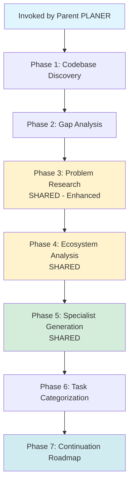

# PLANER-PROGRESS: Project Continuation Planning (Child of PLANER)

> **Note:** This is a child skill of PLANER. It inherits shared phases (3, 4, 5) from the parent.
> - **Parent:** `~/.claude/skills/planer/SKILL.md`
> - **Shared Logic:** `~/.claude/skills/planer/shared/`
> - **Invoked by:** Parent PLANER when existing project is detected

## Overview

PLANER-PROGRESS is the evolution of PLANER-ZERO for **projects in progress**. While PLANER-ZERO starts from scratch, PLANER-PROGRESS picks up where you left off - analyzing existing codebases, identifying gaps, researching problems (both general and specific to your code), and creating actionable roadmaps to completion.

**Key Innovation:** Discovers what exists, finds what's missing, and prioritizes work into FIX, IMPROVE, ADD, REFACTOR, TEST, and DOCUMENT categories with clear priorities (P0-P3).

---

## When Used

PLANER-PROGRESS is automatically invoked by parent PLANER when:
- ✅ `.git` directory exists with commit history
- ✅ Source code files found (*.js, *.php, *.py, etc.)
- ✅ Package/dependency files exist (package.json, composer.json, etc.)
- ✅ User explicitly mentions "continue", "fix", "improve existing"

---

## Workflow: 7 Phases



---

## Phase 1: Codebase Discovery

**Goal:** Understand what exists, what works, what's broken, what's incomplete

**Approach:** Delegate to **Explore agent** (thorough mode) with specific discovery prompts

### Discovery Tasks

#### 1.1 Project Structure Analysis
Use Explore agent to map the codebase:
```
Task: "Analyze the project structure and identify:
- Project type (WordPress theme, Next.js app, API, etc.)
- Tech stack (frameworks, libraries, build tools)
- Directory structure and organization patterns
- Entry points and main configuration files
Output: project_structure.json"
```

**Output:** `project_structure.json` (~3k tokens)

#### 1.2 Feature Inventory
```
Task: "Catalog all implemented features:
- List all custom blocks/components and their functionality
- Identify third-party integrations (WooCommerce, Stripe, etc.)
- Find API endpoints and routes
- Map customizer settings or admin UI
Output: feature_inventory.json"
```

**Output:** `feature_inventory.json` (~3k tokens)

#### 1.3 Code Quality Scan
```
Task: "Scan for code quality indicators:
- TODO/FIXME comments (incomplete work)
- Debug code left behind (console.log, var_dump)
- Deprecated functions or patterns
- Missing error handling
- Security concerns (unescaped output, unsanitized input)
- Performance issues (large bundles, N+1 queries)
Output: quality_report.json"
```

**Output:** `quality_report.json` (~2k tokens)

**Total Phase 1:** 8k tokens (main context)

---

## Phase 2: Gap Analysis

**Goal:** Identify what's built vs. what's planned/needed

**Approach:** Ask user about goals, compare against standards

### User Requirements Clarification

Use `AskUserQuestion`:

```yaml
questions:
  - question: "What is the primary goal for this project's next phase?"
    header: "Project Goal"
    multiSelect: false
    options:
      - label: "Complete Existing Features"
        description: "Finish incomplete work, fix bugs, polish what exists"
      - label: "Add New Features"
        description: "Extend functionality with new capabilities"
      - label: "Refactor & Optimize"
        description: "Improve code quality, performance, security"
      - label: "Prepare for Launch"
        description: "Testing, documentation, deployment readiness"

  - question: "What specific improvements are most important?"
    header: "Priorities"
    multiSelect: true
    options:
      - label: "Performance Optimization"
        description: "Faster load times, smaller bundles, better Core Web Vitals"
      - label: "Accessibility (a11y)"
        description: "WCAG compliance, keyboard navigation, screen readers"
      - label: "Security Hardening"
        description: "Input validation, output escaping, vulnerability fixes"
      - label: "Testing & Quality"
        description: "Unit tests, integration tests, CI/CD"
      - label: "Documentation"
        description: "Developer docs, user guides, inline comments"
```

**Output:** `gap_analysis.json` (~6k tokens)

---

## Phase 3: Problem Research (SHARED - Enhanced)

**Inherited from:** `~/.claude/skills/planer/shared/phase-2-problem-research.md`

**Enhancement for PLANER-PROGRESS:**
- Executes standard problem research (like PLANER-ZERO)
- **PLUS:** Searches for problems specific to patterns found in existing code

**Example:**
- Quality scan found "45KB bundle" → Search: "webpack bundle optimization 2026"
- Quality scan found "Interactivity API usage" → Search: "context loss async callbacks 2026"

**Output:** `problems.json` (enhanced with project-specific problems) (~10k tokens)

---

## Phase 4: Ecosystem Analysis (SHARED)

**Inherited from:** `~/.claude/skills/planer/shared/phase-3-ecosystem-analysis.md`

Identifies existing agents/skills and gaps (same as PLANER-ZERO).

**Output:** `tool_inventory.json` (~4k tokens)

---

## Phase 5: Specialist Generation (SHARED)

**Inherited from:** `~/.claude/skills/planer/shared/phase-4-specialist-generation.md`

Creates reusable specialist agents (same as PLANER-ZERO).

**Output:** Specialist agents + metadata (~2k tokens main context)

---

## Phase 6: Task Categorization & Prioritization

**Goal:** Break work into categorized, prioritized tasks

**NEW: Task Categories:**

1. **FIX** - Bugs, security issues, critical problems
2. **IMPROVE** - Performance, accessibility, code quality
3. **REFACTOR** - Technical debt, code organization
4. **ADD** - New features, functionality
5. **TEST** - Automated tests, quality assurance
6. **DOCUMENT** - Docs, comments, guides

### Prioritization Matrix

| Priority | Category | Criteria |
|----------|----------|----------|
| **P0 - Critical** | FIX | Security vulnerabilities, broken functionality, data loss risk |
| **P1 - High** | FIX, IMPROVE | Major bugs, performance issues, user-facing problems |
| **P2 - Medium** | IMPROVE, ADD, REFACTOR | User-requested features, moderate debt, minor bugs |
| **P3 - Low** | ADD, DOCUMENT, TEST | Nice-to-have features, documentation, non-critical items |

**Output:** `task_roadmap.json` (~10k tokens)

---

## Phase 7: Continuation Roadmap

**Goal:** Final actionable plan with priorities and commands

**Output:** `continuation_roadmap.md` (~18k tokens)

**Format:**
````markdown
# Continuation Roadmap: [Project Name]

## Executive Summary
- What exists (✅)
- What's missing (❌)
- Critical issues found (🔴)

## Priority Roadmap

### 🔥 Phase 1: Critical Fixes (P0-P1)
[Tasks that must be done first]

### 🚀 Phase 2: High-Priority Improvements (P1)
[Performance, accessibility, tests - can run in parallel]

### 🎨 Phase 3: New Features (P2)
[Enhancements and additions]

### 📚 Phase 4: Documentation & Polish (P2-P3)
[Docs, cleanup, nice-to-haves]

## Problem-Aware Development
[Specialist agents created + common pitfalls prevented]

## Execution Commands
[Exact commands to run for each phase]

## Success Metrics
[Before/After comparison]

## Technical Debt Backlog
[Items not in critical path but should be addressed]
````

---

## Context Management

**Token Budget:**

| Phase | Main Agent | Sub-Agent (Isolated) | Running Total |
|-------|-----------|---------------------|---------------|
| Codebase Discovery (1) | 8k | 35k exploration | 8k |
| Gap Analysis (2) | 6k | 15k comparison | 14k |
| [SHARED] Problem Research (3) | 10k summary | 30k WebSearch | 24k |
| [SHARED] Ecosystem Analysis (4) | 4k summary | 20k analysis | 28k |
| [SHARED] Specialist Generation (5) | 2k metadata | 20k writing | 30k |
| Task Categorization (6) | 10k | 25k planning | 40k |
| Continuation Roadmap (7) | 18k | 0 | 58k |

**Total Main Context:** 58k / 200k = **29%** ✓

---

## Templates

**Location:** `children/planer-progress/templates/`

### project_structure.json
```json
{
  "project_type": "WordPress Block Theme | Next.js App | etc.",
  "tech_stack": {
    "framework": "...",
    "build_tool": "...",
    "languages": ["..."]
  },
  "directory_structure": {
    "blocks/": "Description",
    "inc/": "Description"
  },
  "entry_points": {
    "main": "functions.php | index.js"
  },
  "estimated_size": {
    "files": 156,
    "lines_of_code": 8500
  }
}
```

### feature_inventory.json
```json
{
  "custom_blocks": [
    {
      "name": "block-name",
      "status": "complete | incomplete",
      "features": ["feature1", "feature2"],
      "dependencies": ["WordPress", "WooCommerce"]
    }
  ],
  "integrations": [...],
  "total_features": 15,
  "completion_estimate": "85%"
}
```

### quality_report.json
```json
{
  "todos_and_fixmes": [
    {
      "file": "path/to/file.js",
      "line": 45,
      "content": "// TODO: ...",
      "priority": "high | medium | low"
    }
  ],
  "security_concerns": [...],
  "performance_issues": [...],
  "code_quality_score": 8.5,
  "critical_issues": 0
}
```

### gap_analysis.json
```json
{
  "user_goals": {
    "primary_goal": "Add New Features",
    "priorities": ["E-commerce", "Performance", "Accessibility"]
  },
  "feature_gaps": {
    "critical": [...],
    "recommended": [...],
    "nice_to_have": [...]
  },
  "incomplete_work": [...],
  "technical_debt": [...]
}
```

### task_roadmap.json
```json
{
  "tasks_by_category": {
    "FIX": [
      {
        "id": "fix_001",
        "priority": "P1",
        "name": "Fix ...",
        "agent": "wordpress-specialist",
        "files_affected": ["..."],
        "commands": ["..."]
      }
    ],
    "IMPROVE": [...],
    "ADD": [...],
    "TEST": [...],
    "DOCUMENT": [...]
  },
  "execution_phases": {
    "phase_1_critical_fixes": {
      "tasks": ["fix_001"],
      "parallelizable": false,
      "priority": "P0-P1"
    }
  }
}
```

---

## Success Criteria

### For PLANER-PROGRESS:
- ✅ Accurately discovers existing codebase structure
- ✅ Identifies real gaps and technical debt
- ✅ Creates prioritized, actionable roadmap
- ✅ Prevents common mistakes through specialists
- ✅ Maintains <50% context usage

---

**Version:** 1.0
**Created:** 2026-01-17
**Parent:** PLANER v1.0
